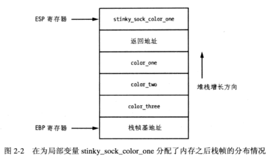
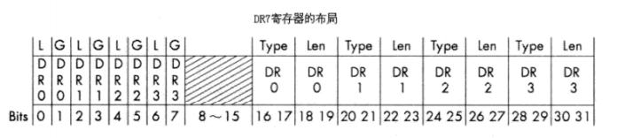

**函数调用约定**(calling convention)描述**如何正确**方式调用某些特定类型的函数。

这包括函数参数在栈上的分配、有哪些参数会压入栈中、而哪些参数将通过寄存器传入，以及在函数返回时函数栈的回收方式。

两个最基本的**函数调用约定**：

cdecl和stdcall

# 2 调试器原理和设计 #

调试器被称为“黑客之瞳”。调试器能够跟踪一个进程的运行时状态，这是动态分析技术。

白盒调试器：源码编程常用的

黑盒调试器：它的设计基于一个假设，就是需要被分析的目标软件对于黑客来说是一个完全不透明的黑盒，黑客唯一获取信息的来源就是那些以汇编代码形式呈现的反汇编结果。

黑盒调试器：1. 用户态调试器2. 内核态调试器

## 2.1 通用寄存器 ##

在X86指令集中，一CPU具有8个通用寄存器：

- EAX 累加器，用于协助执行一些常见的运算操作以及用于**传递函数调用的返回值（牢记）**。你可以基于存储在EAX中的值来判断一个函数调用所执行的操作时候成功或失败
- EDX 是一**数据寄存器**，可认为其为EAX的延伸，用于协助如乘或除的复杂指令运算，存储这些指令操作的额外的数据结果。 EDX也可用于通用的数据存储
- ECX 成为**计数器**，用于支持**循环**操作。特别注意的是该寄存器是**反向计数**的，非正向计数的。汇编代码中计数都是反向进行

在X86中，数据处理的循环操作依赖于**ESI**和**EDI**

- ESI 源变址寄存器，存储着输入数据流的位置信息，用于“读”
- EDI 目的变址寄存器，指向相关数据操作结果的存放位置，用于“写”

ESP，EBP用于控制函数调用和相关的栈操作。

当一个函数被调用时，调用参数连同函数的返回地址将先后被压入函数栈中。

- ESP 栈指针 ，该寄存器始终指向函数栈的最顶端，由此不难推断出在调用函数中某一时刻，ESP指向了函数的返回地址。
- EBP 基址指针 ，该寄存器被用于指向函数栈的底端。在某些情况下，可用于通用寄存器

- EBX 唯一一个**没有**被指定**特殊用途**的寄存器。它可作为额外的存储单元来使用。

---

另外**EIP寄存器**，该寄存器始终指向当前正在执行的指令。当CPU穿行于二进制代码中，**EIP寄存器**中的值随之更新以实时反映当前代码所执行到的位置

一个调试器应当能够轻易读取和修改这些寄存器的内容。

## 2.2 栈 ##

栈是二进制代码中用于实现函数调用机制的基石

FILO First in, Last out

ESP记录当前栈帧的顶部
EBP记录当前栈帧的底部

栈是由内存高地址向内存低地址的反向增长

用my_socks()函数举例

当my_socks()函数返回时，此时位于栈帧的值将全部出栈，接着程序流将跳转至返回地址，并在作为my_stocks"调用者"的上一个函数中继续执行。

---

**局部变量**

局部变量是一些分配在栈上的并只对当前被调用的函数有效的内存区域

## 2.3 调试事件 ##

调试内部实际上是一个无限循环，这个循环每执行一次，调试器就会使自己进入“阻塞”状态，以等待调试事件的发生。当一个调试事件发生时，调试器就将被激活，并调用相应的处理例程处理该事件。

当事件处理例程被调用时，被调试的目标进程暂停并等待调试器做出如何继续的指示

一个调试器必须捕获以下常见调试事件

- 断点触发
- 非法内存操作（也被称非法访问或者段违规）
- 由被调试程序抛出的异常

## 2.4 断点 ##

通过设置断点，使一个进程的执行暂停在一个符合某种特定条件的位置上。此时，你可对程序变量、栈上的参数以及内存分配状态进行检查，并在目标进程对这些值做出任何改变之前将它们记录下来。

### 2.4.1 软断点 ###

软断点实质上是一个单字节长的指令，该指令可以使被调试的目标进程暂停执行并将控制权转交给调试器的异常处理例程

X86中,汇编指令

	MOV EAX, EBX

这指令告诉CPU将寄存器EBX中的值存放在到寄存器EAX中。

上面CPU操作码是

	8BC3

---

软断点设置流程

---

软断点有两种

- 一次性断点
- 永久断点

---

**注意CRC**

当使用软中断，当你在内存中改变可执行代码的某个字节是，实际上同时改变了这运行程序的循环冗余校验值（CRC）

CRC校验算法用于检验数据是否收到任何方式的篡改，这用于检查文件、内存、文本网络封装包或者任何需要监控数据篡改的场合。

CRC校验将选取一定范围内的数据计算出校验码

然后通过将这校验码和已知的匹配。若匹配不成功，则CRC校验失败

CRC校验失败可导致软件的自我了断，限制动态分析与逆程序

### 2.4.2 硬件断点 ###

该断点适用于以下场合：1.当少量断点即可满足我们的调试任务，或者2.我们的调试目标实现了类似CRC校验的反调试机制。

这断点通过CPU特殊寄存器——**调试寄存器**实现

一个典型的CPU上应当有**8个**调试寄存器（DR0~DR7）分别用于设置和管理硬件断点

- DR0~DR3用于存储设硬件断点的内存地址。这意味着**最多使用4个硬件断点**（缺点）

- DR4、DR5保留使用

- DR6 为**调试状态寄存器**，这个寄存器记录了上一次断点触发所发生的调试事件类型信息

- DR7硬件断点的激活开关，同时还存储着各个断点的触发条件信息，可有以下几种触发条件

	- 当位于一个特定内存地址上的指令被执行时触发的断点
	- 当数据被写入一个特定内存地址时触发断点
	- 当数据被读出或写入（不包括执行）一个特定非可执行内存地址时触发断点

---

DR7布局

DR7寄存器的0~7位是硬件断点的开关，0~7上的L域和G域分别对应局部断点和全部断点

8~15位并非用于普通调试

16~31位决定了有关调试寄存器上所设断点的类型和字节长度

与软断点使用INT3软中断事件，硬件断点使用1号中断INT1

### 2.4.3 内存断点 ###

内存断点本质生不是真正断点。

**内存页是操作系统可以一次处理的最小内存块**。

当一个调试器设置一个内存断点时，调试器实际所做的是改变一个内存区域或一个内存页的**访问权限**

操作系统每分配一个内存页时，都会为这个内存页设置访问权限，该权限决定了这个内存页被访问的方式。

内存访问权限例子

- 页可执行
- 页可读
- 页可写
- 保护页

大多数操作系统允许组合访问权限

---

**保护页**这权限值得注意

利用保护页特性实现内存断点机制

当进程访问一个特定区域内的内容时，可让进程暂停执行

例子：

基于网络服务器应用通常有一个缓冲区用于专门存储从网络上接受到的数据包，对其逆向工程，可以对这块内存区域设置内存断点。

这使得我们可以判断出这个应用何时、如何处理接收数据包内容，

**因为任何对于这块区域内的内存访问会导致CPU暂停执行当前进程并触发一个保护页调试异常**

然后就可以对访问块缓冲区的指令代码进行仔细的调查，并判断出应用如何处理缓冲区中的内容。

利用这种断点技术同样可以绕过软断点所面临的指令篡改问题，因为没有对运行的代码做出改动

# 3 构建自己的Windows调试器 #

## Debugee,敢问你在何处 ##

调试器具备两种基本能力：1.打开一个可执行文件并使之以自身子进程的形式运行起来的能力，2附加一个向右进程的能力

Windows系统下创建一个新进程可交由函数CreateProcessA()来完成。

重要的参数

- lpApplicationName 用于设置可执行文件的所在路径
- lpCommandLine 接受的命令行参数
- dwCreationFlag 赋予特定的取值，最终生成的进程即可具备可调试的特性
- lpStartupInfo 用于指定进程的启动方式
- lpProcessInformation 记录进程成功启动之后的相关状态信息

---

所有结构体，联合体以及常量值定义放在my_debugger_defines.py

	from ctypes import *
	
	# Let's map the Microsoft types to ctypes for clarity
	WORD      = c_ushort
	DWORD     = c_ulong
	LPBYTE    = POINTER(c_ubyte)
	LPTSTR    = POINTER(c_char) 
	HANDLE    = c_void_p
	
	# Constants
	DEBUG_PROCESS         = 0x00000001
	CREATE_NEW_CONSOLE    = 0x00000010
	
	# Structures for CreateProcessA() function
	# STARTUPINFO describes how to spawn the process
	class STARTUPINFO(Structure):
	    _fields_ = [
	        ("cb",            DWORD),        
	        ("lpReserved",    LPTSTR), 
	        ("lpDesktop",     LPTSTR),  
	        ("lpTitle",       LPTSTR),
	        ("dwX",           DWORD),
	        ("dwY",           DWORD),
	        ("dwXSize",       DWORD),
	        ("dwYSize",       DWORD),
	        ("dwXCountChars", DWORD),
	        ("dwYCountChars", DWORD),
	        ("dwFillAttribute",DWORD),
	        ("dwFlags",       DWORD),
	        ("wShowWindow",   WORD),
	        ("cbReserved2",   WORD),
	        ("lpReserved2",   LPBYTE),
	        ("hStdInput",     HANDLE),
	        ("hStdOutput",    HANDLE),
	        ("hStdError",     HANDLE),
	        ]
	
	# PROCESS_INFORMATION receives its information
	# after the target process has been successfully
	# started.
	class PROCESS_INFORMATION(Structure):
	    _fields_ = [
	        ("hProcess",    HANDLE),
	        ("hThread",     HANDLE),
	        ("dwProcessId", DWORD),
	        ("dwThreadId",  DWORD),
	        ]

创建debugger

	from ctypes import *
	from my_debugger_defines import *
	
	kernel32 = windll.kernel32
	
	class debugger():
	
	    def __init__(self):
	        pass
	
	    def load(self,path_to_exe):
	        
	        # dwCreation flag determines how to create the process
	        # set creation_flags = CREATE_NEW_CONSOLE if you want
	        # to see the calculator GUI
	        creation_flags = DEBUG_PROCESS
	    
	        # instantiate the structs
	        startupinfo         = STARTUPINFO()
	        process_information = PROCESS_INFORMATION()
	        
	        # The following two options allow the started process
	        # to be shown as a separate window. This also illustrates
	        # how different settings in the STARTUPINFO struct can affect
	        # the debuggee.
	        startupinfo.dwFlags     = 0x1
	        startupinfo.wShowWindow = 0x0
	        
	        # We then initialize the cb variable in the STARTUPINFO struct
	        # which is just the size of the struct itself
	        startupinfo.cb = sizeof(startupinfo)
	        
	        if kernel32.CreateProcessA(path_to_exe,
	                                   None,
	                                   None,
	                                   None,
	                                   None,
	                                   creation_flags,
	                                   None,
	                                   None,
	                                   byref(startupinfo),
	                                   byref(process_information)):
	            
	            print "[*] We have successfully launched the process!"
	            print "[*] The Process ID I have is: %d" % \
	                         process_information.dwProcessId
	        else:    
	            print "[*] Error with error code %d." % kernel32.GetLastError()

运行

	import my_debugger
	
	debugger = my_debugger.debugger()
	
	debugger.load("C:\\Windows\\System32\\calc.exe")

运行结果

	[*] We have successfully launched the process!
	[*] The Process ID I have is: 6208

并没有计算器在显示屏绘制出来

---

附加调试器至现有进程

