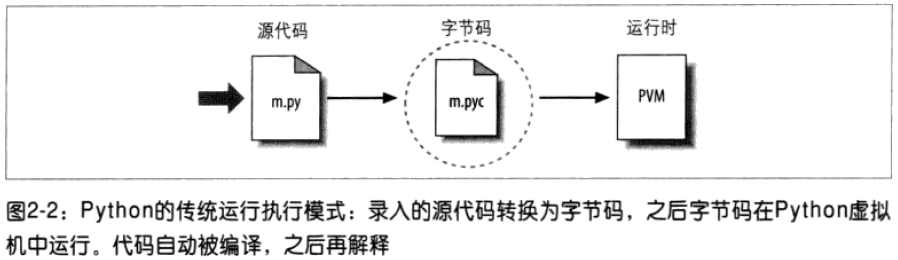

# Python如何运行程序 #

## Python解释器简介 ##

[Python官网](https://www.python.org)

## 程序执行 ##

### 程序员视角 ###

命令行运行python

	$ python a.py
	Hello, World
	1267650600228229401496703205376

### Python视角 ###

.pyc就是编译过的.py源代码

从更基础的角度来说，牢记在Python中真正拥有的只有运行时：完全**不需要**初始的编译阶段，所有的事情都是在程序运行时发生的。

## 执行模块的变体 ##

### Python实现的替代者 ###

- CPython
- Jython
- IronPython

### 执行优化工具 ###

- Psyco实时编译器
- Shedskin C++转化器

### 冻结二进制文件 ###

通过从网络上获得的一些第三方工具，将Python程序转为可执行程序（在Python世界中称为**冻结二进制文件Frozen Binary**）是有可能的。

冻结二进制文件能够将程序的字节码，PVM解释器以及任何程序所需要的Python支持文件捆绑在一起形成单独的文件包。

用户无需额外安装Python，就可运行Frozen Binary。

### 其他执行选项 ###

- Stackless Python
- Cython

### 未来的可能性 ###

## 本章小结 ##

