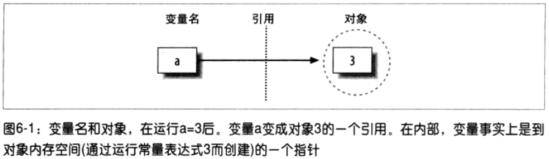
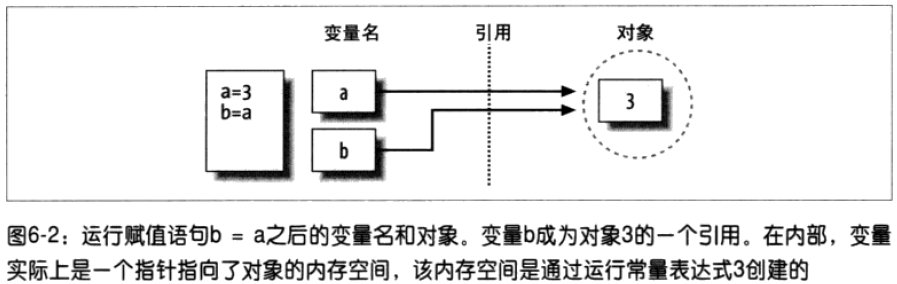
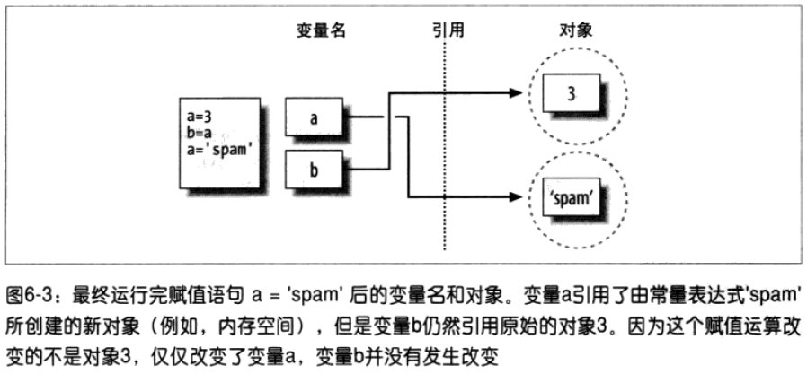

# 动态类型简介 #

[1.缺少类型声明语句的情况](#缺少类型声明语句的情况)

[1.1.变量、对象和引用](#变量对象和引用)

[1.2.类型属于对象、而不是变量](#类型属于对象而不是变量)

[1.3.对象的垃圾收集](#对象的垃圾收集)

[2.共享引用](#共享引用)

[2.1.共享引用和在原处修改](#共享引用和在原处修改)

[2.2.共享引用和相等](#共享引用和相等)

[3.动态类型随处可见](#动态类型随处可见)

## 缺少类型声明语句的情况 ##

在Python中，类型是在运行过程中自动决定的，而不是通过代码声明。

### 变量、对象和引用 ###

### 类型属于对象、而不是变量 ###

	>>> a = 3          # It's an integer
	>>> a = 'spam'     # Now it's a string
	>>> a = 1.23       # Now it's a floating point

类型属于对象、而不是变量，这样代码会更加地灵活。

### 对象的垃圾收集 ###

引用计数器：对象的引用计数器为0，对象的内存空间将会自动回收。

好处：可以在脚本中任意使用对象而不需要考虑释放内存空间。

注意相互或循环引用的情况，这要特殊对待。

## 共享引用 ##

	>>> a = 3
	>>> b = a

	>>> a = 'spam'

在Python中，变量总是一个指向对象的指针，而不是可改变的内存区域的标签：给一个变量赋予一新值，并不是替换原始的对象，而是让这个变量去引用完全不同的一个对象。

### 共享引用和在原处修改 ###

	>>> L1 = [2, 3, 4]    # A mutable object
	>>> L2 = L1           # Make a reference to the same object
	>>> L1[0] = 24        # An in-place change
	>>> L1                # L1 is different
	[24, 3, 4]
	>>> L2                # But so is L2!
	[24, 3, 4]

两个变量引用同一对象，通过一变量改变对象内部值（如列表），访问另一变量会得到修改后的对象。

若不希望用这行为：可用了两种方法：

1. 列表的分片
2. 标准库的copy模块的拷贝函数

	>>> L1 = [2, 3, 4]
	>>> L2 = L1[:]        # Make a copy of L1
	>>> L1[0] = 24
	>>> L1
	[24, 3, 4]
	>>> L2                # L2 is not changed
	[2, 3, 4]

---

	import copy
	X = copy.copy(Y)         # Make top-level "shallow" copy of any object Y
	X = copy.deepcopy(Y)     # Make deep copy of any object Y: copy all nested parts

### 共享引用和相等 ###

	>>> x = 42
	>>> x = 'shrubbery'      # Reclaim 42 now

Python缓存并复用小的整数和小的字符串，上42并不会立马回收，相反会缓存起来，供下次使用。

---

	>>> L = [1, 2, 3]
	>>> M = L                # M and L reference the same object
	>>> L == M               # Same value
	True
	>>> L is M               # Same object
	True

== 测试量被引用对象是否有**相同值**。
is 检查对象同一性（内存同一空间）

	>>> L = [1, 2, 3]
	>>> M = [1, 2, 3]        # M and L reference different objects
	>>> L == M               # Same values
	True
	>>> L is M               # Different objects
	False

	>>> X = 42
	>>> Y = 42               # Should be two different objects
	>>> X == Y
	True
	>>> X is Y               # Same object anyhow: caching at work! # 引用同一缓存值
	True

刨根问底，sys.getrefcount函数返回对象的引用次数

	>>> import sys
	>>> sys.getrefcount(1)   # 837 pointers to this shared piece of memory
	837

	>>> L=[1,2,3]
	>>> sys.getrefcount(L)
	2
	>>> L2=L
	>>> sys.getrefcount(L)
	3
	>>>

## 动态类型随处可见 ##

动态类型是Python的唯一的赋值模型。
