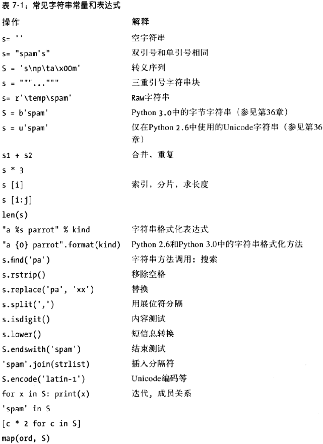
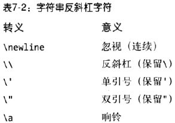
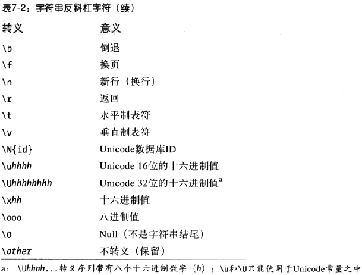
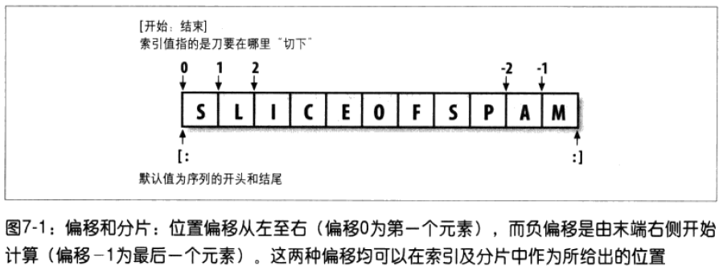
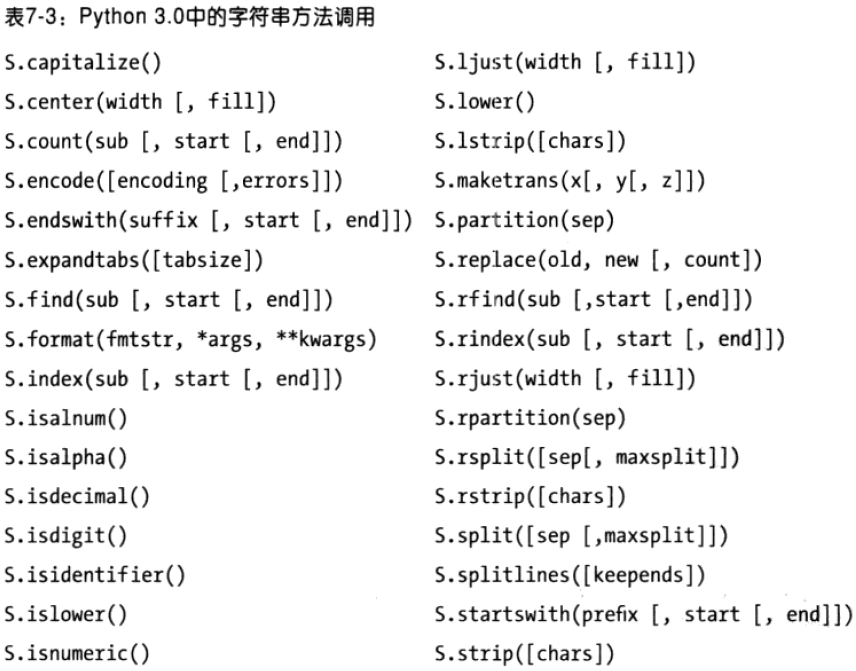
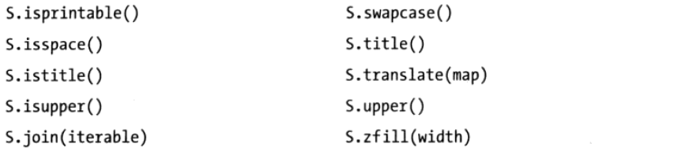
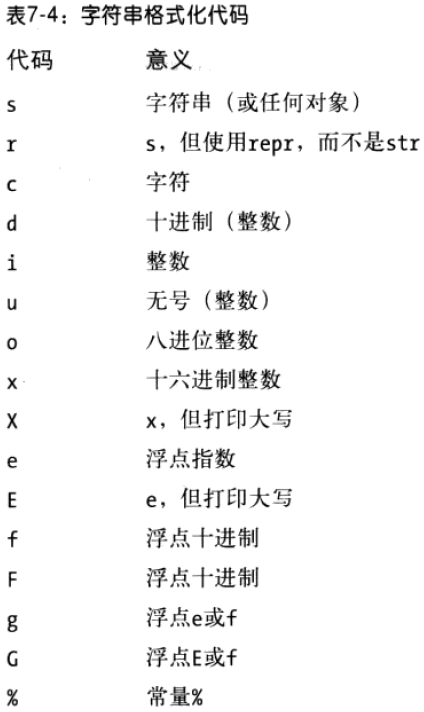

# 字符串 #

[1.字符串常量](#字符串常量)

[1.1.单双引号字符串是一样的](#单双引号字符串是一样的)

[1.2.用转义序列代表特殊字节](#用转义序列代表特殊字节)

[1.3.raw字符串抑制转义](#raw字符串抑制转义)

[1.4.三重引号编写多行字符串块](#三重引号编写多行字符串块)

[2.实际应用中的字符串](#实际应用中的字符串)

[2.1.基本操作](#基本操作)

[2.2.索引和分片](#索引和分片)

[2.2.1.扩展分片—第三个限制值](#扩展分片第三个限制值)

[2.3.为什么要在意：分片](#为什么要在意分片)

[2.4.字符串转换工具](#字符串转换工具)

[2.5.修改字符串](#修改字符串)

[3.字符串方法](#字符串方法)

[3.1.字符串方法实例：修改字符串](#字符串方法实例修改字符串)

[3.2.字符串方法实例：文本解析](#字符串方法实例文本解析)

[3.3.其他常见的字符串方法](#其他常见的字符串方法)

[3.4.最初的字符串模块](#最初的字符串模块)

[4.字符串格式化表达式](#字符串格式化表达式)

[4.1.更高级的字符串格式化表达式](#更高级的字符串格式化表达式)

[4.2.基于字典的字符串格式化](#基于字典的字符串格式化)

[5.字符串格式化调用方法](#字符串格式化调用方法)

[5.1.基础知识](#基础知识)

[5.2.添加键、属性和偏移量](#添加键属性和偏移量)

[5.3.添加具体格式化](#添加具体格式化)

[5.4.与%格式化表达式比较](#与%格式化表达式比较)

[5.5.为什么用新的格式化方法](#为什么用新的格式化方法)

[5.5.1.额外功能](#额外功能)

[5.5.2.显式值引用](#显式值引用)

[5.5.3.方法名和通用参数](#方法名和通用参数)

[6.通常意义下的类型分类](#通常意义下的类型分类)

[6.1.同样分类的类型共享其操作集合](#同样分类的类型共享其操作集合)

[6.2.可变类型能够在原处修改](#可变类型能够在原处修改)

[7.小结](#小结)

Python通过包含各种不同的对象类型，解决了文本和二进制数据之间的区别：

1. Python3有三种字符串类型：
	1. str用于Unicode（ASCII或其他）
	2. bytes用于二进制数据（包括编码的文本）
	3. bytearray是bytes的一种可变的变体
2. Python2.6
	1. unicode字符串表示宽Unicode文本，str字符串处理8位文本和二进制数据

## 字符串常量 ##

- 单引号 'spa"m'
- 双引号 "spa'm"
- 三引号 '''...spam...''',"""...spam..."""
- 转义字符 "a\nb\tc"
- raw字符串： r"C:\new"
- Python3的Byte字符串 b'sp\x01am'
- Python2.6使用的Unicode字符串 u'eggs\u0020spam'

### 单双引号字符串是一样的 ###

	>>> 'shrubbery', "shrubbery"
	('shrubbery', 'shrubbery')

	>>> 'knight"s', "knight's"
	('knight"s', "knight's")

	>>> title = "Meaning " 'of' " Life"     # Implicit concatenation
	>>> title
	'Meaning of Life'

	>>> 'knight\'s', "knight\"s"
	("knight's", 'knight"s')

### 用转义序列代表特殊字节 ###

	>>> s = 'a\nb\tc'

	>>> s
	'a\nb\tc'
	>>> print(s)
	a
	b c

	>>> len(s)
	5

	>>> s = 'a\nb\tc'

	>>> s
	'a\nb\tc'
	>>> print(s)
	a
	b c

	>>> len(s)
	5

---

	>>> s = 'a\0b\0c'
	>>> s
	'a\x00b\x00c'
	>>> len(s)
	5

	>>> s = '\001\002\x03'
	>>> s
	'\x01\x02\x03'
	>>> len(s)
	3

	>>> S = "s\tp\na\x00m"
	>>> S
	's\tp\na\x00m'
	>>> len(S)
	7
	>>> print(S)
	s p
	a m

	>>> x = "C:\py\code"          # Keeps \ literally
	>>> x
	'C:\\py\\code'
	>>> len(x)
	10

### raw字符串抑制转义 ###

	myfile = open('C:\new\text.dat', 'w')

\n，\t是转义符，这样上面代码打不开文件。

解决两方法

	# raw字符串
	myfile = open(r'C:\new\text.dat', 'w')

	# \\转义符
	myfile = open('C:\\new\\text.dat', 'w')

	>>> path = r'C:\new\text.dat'
	>>> path                        # Show as Python code
	'C:\\new\\text.dat'
	>>> print(path)                 # User-friendly format
	C:\new\text.dat
	>>> len(path)                   # String length
	15

### 三重引号编写多行字符串块 ###

	>>> mantra = """Always look
	... on the bright
	... side of life."""
	>>>
	>>> mantra
	'Always look\n on the bright\nside of life.'

	>>> print(mantra)
	Always look
	 on the bright
	side of life.

	X = 1
	"""
	import os                   # Disable this code temporarily
	print(os.getcwd())
	"""
	Y = 2

## 实际应用中的字符串 ##

### 基本操作 ###

	>>> len('abc')           # Length: number of items
	3
	>>> 'abc' + 'def'        # Concatenation: a new string
	'abcdef'
	>>> 'Ni!' * 4            # Repetition: like "Ni!" + "Ni!" + ...
	'Ni!Ni!Ni!Ni!'

	>>> print('------- ...more... ---')       # 80 dashes, the hard way
	>>> print('-' * 80)

	>>> myjob = "hacker"
	>>> for c in myjob: print(c, end=' ')     # Step through items
	...
	h a c k e r

	>>> "k" in myjob              # Found
	True
	>>> "z" in myjob              # Not found
	False
	>>> 'spam' in 'abcspamdef'    # Substring search, no position returned
	True

### 索引和分片 ###

	>>> S = 'spam'
	>>> S[0], S[-2]               # Indexing from front or end
	('s', 'a')
	>>> S[1:3], S[1:], S[:-1]     # Slicing: extract a section
	('pa', 'pam', 'spa')

#### 扩展分片—第三个限制值 ####

第三个索引用作步进stride。

`X[I:J:K]`表示“索引X对象中的元素，从偏移为I直到偏移为J-1，每隔K元素索引一次”。K默认为1.

	>>> S = 'abcdefghijklmnop'
	>>> S[1:10:2]# 索引从0到9、每隔一个元素
	'bdfhj'
	>>> S[::2] # 从头到尾、每隔一个元素
	'acegikmo'

	# -1表示分片将会从右至左而不是通常的从左至右
	>>> S = 'hello'
	>>> S[::-1]
	'olleh'

	>>> S = 'abcedfg'
	>>> S[5:1:-1]
	'fdec'

	# 用一个分片对象进行索引
	>>> 'spam'[1:3]              # Slicing syntax
	'pa'
	>>> 'spam'[slice(1, 3)]      # Slice objects
	'pa'
	>>> 'spam'[::-1]
	'maps'
	>>> 'spam'[slice(None, None, -1)]
	'maps'

### 为什么要在意：分片 ###

用作命令行参数分片

	# File echo.py
	import sys
	print(sys.argv)

	% python echo.py -a -b -c
	['echo.py', '-a', '-b', '-c']

读取文件内容

	line[:-1]//可用line.rstrip()函数

### 字符串转换工具 ###

	>>> "42" + 1
	TypeError: cannot concatenate 'str' and 'int' objects

	# repr函数将一个对象转换为其字符串形式，然而这些返回的对象将作为代码的字符串，可以重新创建对象。
	>>> int("42"), str(42)      # Convert from/to string
	(42, '42')
	>>> repr(42)                # Convert to as-code string
	'42'

	>>> print(str('spam'), repr('spam'))
	('spam', "'spam'")

	>>> S = "42"
	>>> I = 1
	>>> S + I
	TypeError: cannot concatenate 'str' and 'int' objects

	>>> int(S) + I         # Force addition
	43

	>>> S + str(I)         # Force concatenation
	'421'

	>>> str(3.1415), float("1.5")
	('3.1415', 1.5)
	>>> text = "1.234E-10"
	>>> float(text)
	1.2340000000000001e-010

字符串代码转换

	#ord函数转换其对应的ASCII码
	>>> ord('s')
	115
	#将ASCII码并将其转化为对应的字符
	>>> chr(115)
	's'

	>>> S = '5'
	>>> S = chr(ord(S) + 1)
	>>> S
	'6'
	>>> S = chr(ord(S) + 1)
	>>> S
	'7'

	>>> int('5')
	5
	>>> ord('5') - ord('0')
	5

	>>> B = '1101'              # Convert binary digits to integer with ord
	>>> I = 0
	>>> while B != '':
	...     I = I * 2 + (ord(B[0]) - ord('0'))
	...     B = B[1:]
	...
	>>> I
	13

	>>> int('1101', 2)      # Convert binary to integer: built-in
	13
	>>> bin(13)             # Convert integer to binary
	'0b1101'

### 修改字符串 ###

	>>> S = 'spam'
	>>> S[0] = "x"
	Raises an error!

	>>> S = S + 'SPAM!'    # To change a string, make a new one
	>>> S
	'spamSPAM!'
	>>> S = S[:4] + 'Burger' + S[-1]
	>>> S
	'spamBurger!'

	>>> S = 'splot'
	>>> S = S.replace('pl', 'pamal')
	>>> S
	'spamalot'

字符串方法都生成了新的字符串对象

	>>> 'That is %d %s bird!' % (1, 'dead')           # Format expression
	That is 1 dead bird!
	>>> 'That is {0} {1} bird!'.format(1, 'dead')     # Format method in 2.6 and 3.0
	'That is 1 dead bird!'

## 字符串方法 ##

### 字符串方法实例：修改字符串 ###

	>>> S = 'spammy'
	>>> S = S[:3] + 'xx' + S[5:]
	>>> S
	'spaxxy'

	>>> S = 'spammy'
	>>> S = S.replace('mm', 'xx')
	>>> S
	'spaxxy'

	>>> 'aa$bb$cc$dd'.replace('$', 'SPAM')
	'aaSPAMbbSPAMccSPAMdd

	>>> S = 'xxxxSPAMxxxxSPAMxxxx'
	>>> where = S.find('SPAM')                # Search for position
	>>> where                                 # Occurs at offset 4
	4
	>>> S = S[:where] + 'EGGS' + S[(where+4):]
	>>> S
	'xxxxEGGSxxxxSPAMxxxx'

	>>> S = 'xxxxSPAMxxxxSPAMxxxx'
	>>> S.replace('SPAM', 'EGGS')         # Replace all
	'xxxxEGGSxxxxEGGSxxxx'
	>>> S.replace('SPAM', 'EGGS', 1)      # Replace one
	'xxxxEGGSxxxxSPAMxxxx'

	>>> S = 'spammy'
	>>> L = list(S)
	>>> L
	['s', 'p', 'a', 'm', 'm', 'y']

	>>> L[3] = 'x'                         # Works for lists, not strings
	>>> L[4] = 'x'
	>>> L
	['s', 'p', 'a', 'x', 'x', 'y']

	>>> S = ''.join(L)
	>>> S
	'spaxxy'

	>>> 'SPAM'.join(['eggs', 'sausage', 'ham', 'toast'])
	'eggsSPAMsausageSPAMhamSPAMtoast'

### 字符串方法实例：文本解析 ###

	>>> line = 'aaa bbb ccc'
	>>> col1 = line[0:3]
	>>> col3 = line[8:]
	>>> col1
	'aaa'
	>>> col3
	'ccc'

	>>> line = 'aaa bbb ccc'
	>>> cols = line.split()
	>>> cols
	['aaa', 'bbb', 'ccc']

	>>> line = 'bob,hacker,40'
	>>> line.split(',')
	['bob', 'hacker', '40']

	>>> line = "i'mSPAMaSPAMlumberjack"
	>>> line.split("SPAM")
	["i'm", 'a', 'lumberjack']

### 其他常见的字符串方法 ###

	>>> line = "The knights who say Ni!\n"
	>>> line.rstrip()
	'The knights who say Ni!'
	>>> line.upper()
	'THE KNIGHTS WHO SAY NI!\n'
	>>> line.isalpha()
	False
	>>> line.endswith('Ni!\n')
	True
	>>> line.startswith('The')
	True

---

	>>> line
	'The knights who say Ni!\n'
	>>> line.find('Ni') != -1            # Search via method call or expression
	True
	>>> 'Ni' in line
	True

	>>> sub = 'Ni!\n'
	>>> line.endswith(sub)               # End test via method call or slice
	True
	>>> line[-len(sub):] == sub
	True

### 最初的字符串模块 ###

	>>> S = 'a+b+c+'

	>>> x = S.replace('+', 'spam')
	>>> x
	'aspambspamcspam

	#旧版本python要引入string模块，Python3已删除此模块
	>>> import string
	>>> y = string.replace(S, '+', 'spam')
	>>> y
	'aspambspamcspam'

## 字符串格式化表达式 ##

	>>> 'That is %d %s bird!' % (1, 'dead')      # Format expression
	That is 1 dead bird!

	# ADDED: the new method equivalent
	>>> 'That is {0:d} {1:s} bird!'.format(1, 'dead')
	That is 1 dead bird!

	>>> exclamation = "Ni"
	>>> "The knights who say %s!" % exclamation
	'The knights who say Ni!'

	>>> "%d %s %d you" % (1, 'spam', 4)
	'1 spam 4 you'

	>>> "%s -- %s -- %s" % (42, 3.14159, [1, 2, 3])
	'42 -- 3.14159 -- [1, 2, 3]'

### 更高级的字符串格式化表达式 ###

	%[(name)][flags][width][.precision]typecode

标志位：

- 左对齐-
- 右对齐+
- 补零0

	>>> x = 1234
	>>> res = "integers: ...%d...%-6d...%06d" % (x, x, x)
	>>> res
	'integers: ...1234...1234 ...001234'
	
	>>> x = 1.23456789
	>>> x
	1.2345678899999999
	
	>>> '%e | %f | %g' % (x, x, x)
	'1.234568e+00 | 1.234568 | 1.23457'
	
	>>> '%E' % x
	'1.234568E+00'
	
	>>> '%-6.2f | %05.2f | %+06.1f' % (x, x, x)
	'1.23 | 01.23 | +001.2'
	
	>>> "%s" % x, str(x)
	('1.23456789', '1.23456789')
	

在格式化字符串中用一个*来指定通过计算得出width和precision，从而迫使他们的值从%运算符右边的输出中的下一项获取，在这里，元组中的4指定为precision:

	>>> '%f, %.2f, %.*f' % (1/3.0, 1/3.0, 4, 1/3.0)
	'0.333333, 0.33, 0.3333'

### 基于字典的字符串格式化 ###

	>>> "%(n)d %(x)s" % {"n":1, "x":"spam"}
	'1 spam'
	
生成类似HTML或XML程序往往利用这一技术。

	>>> reply = """                               # Template with substitution targets
	Greetings...
	Hello %(name)s!
	Your age squared is %(age)s
	"""
	>>> values = {'name': 'Bob', 'age': 40}       # Build up values to substitute
	>>> print(reply % values)                     # Perform substitutions
	
	Greetings...
	Hello Bob!
	Your age squared is 40
	
	# 小技巧 vars()返回全局变量
	>>> food = 'spam'
	>>> age = 40
	>>> vars()
	{'food': 'spam', 'age': 40, ...many more... }
	
	>>> "%(age)d %(food)s" % vars()
	'40 spam'

## 字符串格式化调用方法 ##

### 基础知识 ###

	>>> template = '{0}, {1} and {2}'                    # By position
	>>> template.format('spam', 'ham', 'eggs')
	'spam, ham and eggs'

	>>> template = '{motto}, {pork} and {food}'          # By keyword
	>>> template.format(motto='spam', pork='ham', food='eggs')
	'spam, ham and eggs'

	>>> template = '{motto}, {0} and {food}'             # By both
	>>> template.format('ham', motto='spam', food='eggs')
	'spam, ham and eggs'

	>>> '{motto}, {0} and {food}'.format(42, motto=3.14, food=[1, 2])
	'3.14, 42 and [1, 2]'

	>>> X = '{motto}, {0} and {food}'.format(42, motto=3.14, food=[1, 2])
	>>> X
	'3.14, 42 and [1, 2]'

	>>> X.split(' and ')
	['3.14, 42', '[1, 2]']

	>>> Y = X.replace('and', 'but under no circumstances')
	>>> Y
	'3.14, 42 but under no circumstances [1, 2]'

### 添加键、属性和偏移量 ###

	# .理解为对象访问属性运算符
	>>> import sys
	>>> 'My {1[spam]} runs {0.platform}'.format(sys, {'spam': 'laptop'})
	'My laptop runs win32'

	>>> 'My {config[spam]} runs {sys.platform}'.format(sys=sys, 
													   config={'spam': 'laptop'})
	'My laptop runs win32'

	>>> somelist = list('SPAM')
	>>> somelist
	['S', 'P', 'A', 'M']

	>>> 'first={0[0]}, third={0[2]}'.format(somelist)
	'first=S, third=A'

	>>> 'first={0}, last={1}'.format(somelist[0], somelist[-1])    # [-1] fails in fmt
	'first=S, last=M'

	>>> parts = somelist[0], somelist[-1], somelist[1:3]           # [1:3] fails in fmt

	# *的一种用法
	>>> 'first={0}, last={1}, middle={2}'.format(*parts)
	"first=S, last=M, middle=['P', 'A']"

### 添加具体格式化 ###

替代目标语法

	{fieldname!conversionflag:formatspec}

- fieldname是指定参数的一个数字或关键字，后面跟着可选的“.name”或“[ index]"”成分引用。

- conversion1qg可以是r、s，或者a分别是在该值上对repr、Str或 ascii内置函数的一次调用。

- formatspec指定了如何表示该值，包括字段宽度、对齐方式、补零、小数点精度等细节，并且以一个可选的数据类型编码结束。

formatspec组织如下：

	[[fill]align][sign][#][0][width][.precision][typecode]

a1ign可能是<、>、=或^，分別表示左对齐、右对齐、一个标记字符后的补充或居中对齐。 Formatspec也包含嵌套的、只帯有{}的格式化字符串，它从参数列表动态地获取值(和格式化表达式中的*很相似)

参见 Python的库手册可以了解关于替换语法的更多信息和可用的类型编码的列表，它们几乎与[前面表](#更高级的字符串格式化表达式)中列出的以及%表达式中使用的那些完全重合，但是格式化方法还允许个“b”类型编码用来以二进制格式显示整数(它等同于使用bin内置函数)，允许个“%”类型编码来显示百分比，并且使用唯一的“d”表示十进制的整数(而不是“i”或“u”)。

	# 10表示字符宽度
	>>> '{0:10} = {1:10}'.format('spam', 123.4567)
	'spam       =   123.4567'

	# >右对齐， <左对齐
	>>> '{0:>10} = {1:<10}'.format('spam', 123.4567)
	'      spam = 123.4567  '

	# .platform表示第0个参数的platform属性，item类似
	>>> '{0.platform:>10} = {1[item]:<10}'.format(sys, dict(item='laptop'))
	'     win32 = laptop  '

	# 浮点数的格式化
	>>> '{0:e}, {1:.3e}, {2:g}'.format(3.14159, 3.14159, 3.14159)
	'3.141590e+00, 3.142e+00, 3.14159'

	>>> '{0:f}, {1:.2f}, {2:06.2f}'.format(3.14159, 3.14159, 3.14159)
	'3.141590, 3.14, 003.14'

	# 八进制、十进制、十六进制的格式化
	>>> '{0:X}, {1:o}, {2:b}'.format(255, 255, 255)    # Hex, octal, binary
	'FF, 377, 11111111'

	>>> bin(255), int('11111111', 2), 0b11111111       # Other to/from binary
	('0b11111111', 255, 255)

	>>> hex(255), int('FF', 16), 0xFF                  # Other to/from hex
	('0xff', 255, 255)

	>>> oct(255), int('377', 8), 0o377, 0377           # Other to/from octal
	('0377', 255, 255, 255)                            # 0377 works in 2.6, not 3.0!

---

	>>> '{0:.2f}'.format(1 / 3.0)                 # Parameters hardcoded
	'0.33'
	>>> '%.2f' % (1 / 3.0)
	'0.33'

	# 可嵌套使用
	>>> '{0:.{1}f}'.format(1 / 3.0, 4)            # Take value from arguments
	'0.3333'
	>>> '%.*f' % (4, 1 / 3.0)                     # Ditto for expression
	'0.3333'

	# 内置format函数，它用来格式化一个单独项
	>>> '{0:.2f}'.format(1.2345)     # String method
	'1.23'
	>>> format(1.2345, '.2f')        # Built-in function
	'1.23'
	>>> '%.2f' % 1.2345              # Expression
	'1.23'

### 与%格式化表达式比较 ###

	# 看来格式化表达式打字比较少
	print('%s=%s' % ('spam', 42))                # 2.X+ format expression

	print('{0}={1}'.format('spam', 42))          # 3.0 (and 2.6) format method

	# The basics: with % instead of format()

	>>> template = '%s, %s, %s'
	>>> template % ('spam', 'ham', 'eggs')                        # By position
	'spam, ham, eggs'

	>>> template = '%(motto)s, %(pork)s and %(food)s'
	>>> template % dict(motto='spam', pork='ham', food='eggs')    # By key
	'spam, ham and eggs'

	>>> '%s, %s and %s' % (3.14, 42, [1, 2])                      # Arbitrary types
	'3.14, 42 and [1, 2]'

	# Adding keys, attributes, and offsets

	>>> 'My %(spam)s runs %(platform)s' % {'spam': 'laptop', 'platform': sys.platform}
	'My laptop runs win32'

	>>> 'My %(spam)s runs %(platform)s' % dict(spam='laptop', platform=sys.platform)
	'My laptop runs win32'

	>>> somelist = list('SPAM')
	>>> parts = somelist[0], somelist[-1], somelist[1:3]
	>>> 'first=%s, last=%s, middle=%s' % parts
	"first=S, last=M, middle=['P', 'A']"

	# Adding specific formatting

	>>> '%-10s = %10s' % ('spam', 123.4567)
	'spam = 123.4567'

	>>> '%10s = %-10s' % ('spam', 123.4567)
	' spam = 123.4567 '

	>>> '%(plat)10s = %(item)-10s' % dict(plat=sys.platform, item='laptop')
	' win32 = laptop '

	# Floating-point numbers

	>>> '%e, %.3e, %g' % (3.14159, 3.14159, 3.14159)
	'3.141590e+00, 3.142e+00, 3.14159'

	>>> '%f, %.2f, %06.2f' % (3.14159, 3.14159, 3.14159)
	'3.141590, 3.14, 003.14'

	# Hex and octal, but not binary
	>>> '%x, %o' % (255, 255)
	'ff, 377'

	# Hardcoded references in both

	>>> import sys
	>>> 'My {1[spam]:<8} runs {0.platform:>8}'.format(sys, {'spam': 'laptop'})
	'My laptop   runs    win32'

	>>> 'My %(spam)-8s runs %(plat)8s' % dict(spam='laptop', plat=sys.platform)
	'My laptop   runs    win32'

	# Building data ahead of time in both

	>>> data = dict(platform=sys.platform, spam='laptop')

	# **特殊语法，它把键和值的一个字典包装到单个的name=value
	>>> 'My {spam:<8} runs {platform:>8}'.format(**data)
	'My laptop   runs    win32'

	>>> 'My %(spam)-8s runs %(platform)8s' % data
	'My laptop   runs    win32'

	# python 3.1 and later
	# 对数字的千分隔位语法

	>>> '{0:d}'.format(999999999999)
	'999999999999'
	>>> '{0:,d}'.format(999999999999)
	'999,999,999,999'

	>>> '{:,d}'.format(999999999999)
	'999,999,999,999'
	>>> '{:,d} {:,d}'.format(9999999, 8888888)
	'9,999,999 8,888,888'
	>>> '{:,.2f}'.format(296999.2567)
	'296,999.26'

### 为什么用新的格式化方法 ###

格式化方法虽然需要更多代码，但它可

- 拥有%表达式所没有的一些额外功能。
- 可以更明确地进行替代值引用。
- 考虑到操作符会有一个更容易记忆的方法名。
- 不支持用于单个和多个替代值大小写的不同语法。

#### 额外功能 ####

	>>> '{0:b}'.format((2 ** 16) -1)
	'1111111111111111'

	>>> '%b' % ((2 ** 16) -1)
	ValueError: unsupported format character 'b' (0x62) at index 1

	>>> bin((2 ** 16) -1)
	'0b1111111111111111'

	>>> '%s' % bin((2 ** 16) -1)[2:]
	'1111111111111111'

#### 显式值引用 ####

	# 下列情景，{i}比%s更易读
	'\n%s<Class %s, address %s:\n%s%s%s>\n' % (...)              # Expression 

	'\n{0}<Class {1}, address {2}:\n{3}{4}{5}>\n'.format(...)    # Method

	# Python3.1新特性
	C:\misc> C:\Python31\python
	>>> 'The {0} side {1} {2}'.format('bright', 'of', 'life')
	'The bright side of life'
	>>>
	>>> 'The {} side {} {}'.format('bright', 'of', 'life') # Python 3.1+
	'The bright side of life'
	>>>
	>>> 'The %s side %s %s' % ('bright', 'of', 'life')
	'The bright side of life'

	C:\misc> C:\Python31\python
	>>> '{0:f}, {1:.2f}, {2:05.2f}'.format(3.14159, 3.14159, 3.14159)
	'3.141590, 3.14, 03.14'
	>>>
	>>> '{:f}, {:.2f}, {:06.2f}'.format(3.14159, 3.14159, 3.14159)
	'3.141590, 3.14, 003.14'
	>>>
	>>> '%f, %.2f, %06.2f' % (3.14159, 3.14159, 3.14159)
	'3.141590, 3.14, 003.14'

#### 方法名和通用参数 ####

	# 使用格式化表达式，多个值必须放入一个元组类
	>>> '%.2f' % 1.2345
	'1.23'
	>>> '%.2f %s' % (1.2345, 99)
	'1.23 99'

	>>> '%s' % 1.23
	'1.23'
	>>> '%s' % (1.23,)
	'1.23'
	>>> '%s' % ((1.23,),)
	'(1.23,)'

	>>> '{0:.2f}'.format(1.2345)
	'1.23'
	>>> '{0:.2f} {1}'.format(1.2345, 99)
	'1.23 99'
	>>> '{0}'.format(1.23)
	'1.23'
	>>> '{0}'.format((1.23,))
	'(1.23,)'

## 通常意义下的类型分类 ##

### 同样分类的类型共享其操作集合 ###

Python中有三个主要类型（以及操作）的分类

- 数字（整数，浮点数，二进制、分数等）支持加法和乘法
- 序列（字符串、列表、元组） 支持索引、分片和合并
- 映射（字典）支持通过键的索引
- 集合（自成一体）的一个分类

### 可变类型能够在原处修改 ###

Python主要核心类型划分为如下两类：

1. 不可变类型（数字、字符串、元组、不可变集合）
2. 可变类型（列表、字典、可变集合）

一般来说，不可变类型有某种完整性，保证这个对象不会被程序的其他部分改变。

## 小结 ##

