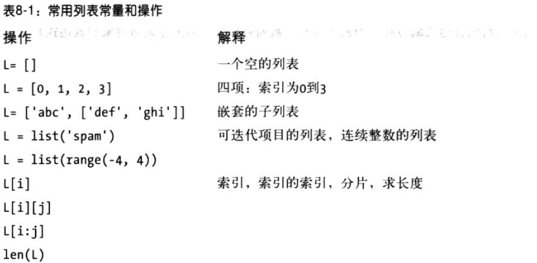
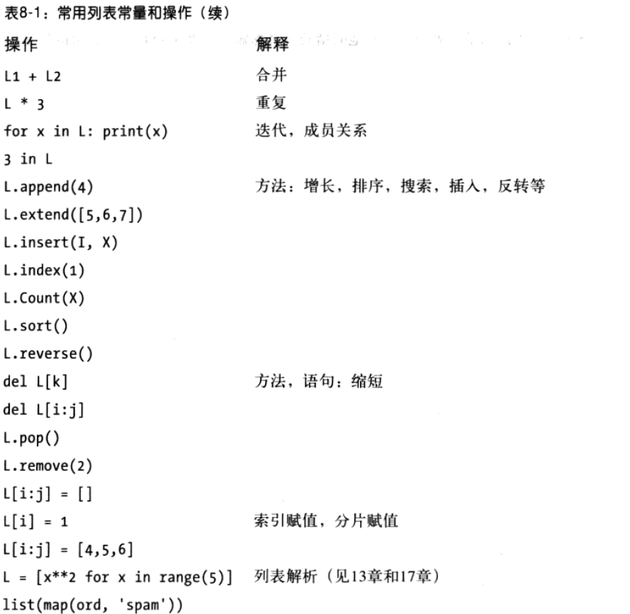
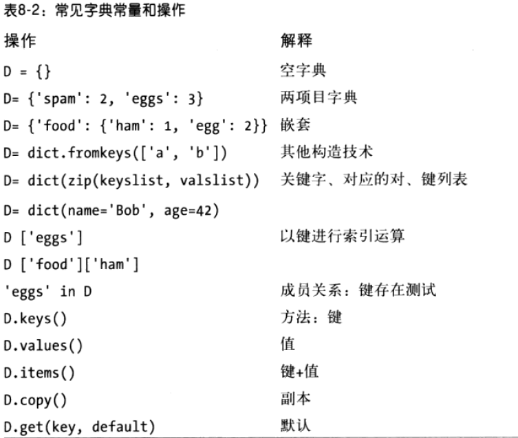
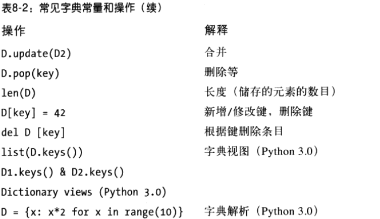

# 列表与字典 #

[1.列表](#列表)

[2.实际应用中的列表](#实际应用中的列表)

[2.1.基本列表操作](#基本列表操作)

[2.2.列表迭代和解析](#列表迭代和解析)

[2.3.索引、分片和矩阵](#索引分片和矩阵)

[2.4.原处修改列表](#原处修改列表)

[2.4.1.索引与分片的赋值](#索引与分片的赋值)

[2.4.2.列表方法调用](#列表方法调用)

[2.4.3.其他常见操作](#其他常见操作)

[3.字典](#字典)

[4.实际应用中的字典](#实际应用中的字典)

[4.1.字典的基本操作](#字典的基本操作)

[4.2.原处修改字典](#原处修改字典)

[4.3.其他字典方法](#其他字典方法)

[4.4.语言表](#语言表)

[4.5.字典用法注意事项](#字典用法注意事项)

[4.5.1.使用字典模拟灵活的列表](#使用字典模拟灵活的列表)

[4.5.2.字典用于稀疏矩阵](#字典用于稀疏矩阵)

[4.5.3.避免missing-key错误](#避免missing-key错误)

[4.5.4.使用字典作为“记录”](#使用字典作为记录)

[4.6.为什么要在意字典接口](#为什么要在意字典接口)

[4.7.创建字典的其他方法](#创建字典的其他方法)

[4.8.Python3.0中的字典变化](#python30中的字典变化)

[4.8.1.字典解析](#字典解析)

[4.8.2.字典视图](#字典视图)

[4.8.3.字典视图和集合](#字典视图和集合)

[4.8.4.排序字典键](#排序字典键)

[4.8.5.字典大小比较不再有效](#字典大小比较不再有效)

[4.8.6.has_key方法已死：in永生](#has_key方法已死in永生)

## 列表 ##

Python列表是：

- 任意对象的有序集合
- 通过偏移读取
- 可变长度、异构以及任意嵌套
- 属于可变序列的分类
- 存放对象引用的数组

## 实际应用中的列表 ##

### 基本列表操作 ###

	>>> len([1, 2, 3])            # Length
	3
	>>> [1, 2, 3] + [4, 5, 6]     # Concatenation
	[1, 2, 3, 4, 5, 6]
	>>> ['Ni!'] * 4               # Repetition
	['Ni!', 'Ni!', 'Ni!', 'Ni!']

	>>> str([1, 2]) + "34"        # Same as "[1, 2]" + "34"
	'[1, 2]34'
	>>> [1, 2] + list("34")       # Same as [1, 2] + ["3", "4"]
	[1, 2, '3', '4']

### 列表迭代和解析 ###

	>>> 3 in [1, 2, 3]            # Membership
	True

	>>> for x in [1, 2, 3]:
	...     print(x, end=' ')     # Iteration
	...
	1 2 3

	# 列表解析式
	>>> res = [c * 4 for c in 'SPAM']      # List comprehensions
	>>> res
	['SSSS', 'PPPP', 'AAAA', 'MMMM']

	# 上面列表解析式等于以下代码
	>>> res = []
	>>> for c in 'SPAM':                   # List comprehension equivalent
	... res.append(c * 4)
	...
	>>> res
	['SSSS', 'PPPP', 'AAAA', 'MMMM']

	# 映射map
	>>> list(map(abs, [-1, -2, 0, 1, 2]))  # map function across sequence
	[1, 2, 0, 1, 2]

### 索引、分片和矩阵 ###

	>>> L = ['spam', 'Spam', 'SPAM!']
	>>> L[2]                                # Offsets start at zero
	'SPAM!'
	>>> L[-2]                               # Negative: count from the right
	'Spam'
	# 返回新的列表
	>>> L[1:]                               # Slicing fetches sections
	['Spam', 'SPAM!']

	# 嵌套列表
	>>> matrix = [[1, 2, 3], [4, 5, 6], [7, 8, 9]]

	>>> matrix[1]
	[4, 5, 6]
	>>> matrix[1][1]
	5
	>>> matrix[2][0]
	7
	>>> matrix = [[1, 2, 3],
	...           [4, 5, 6],
	...           [7, 8, 9]]
	>>> matrix[1][1]
	5

### 原处修改列表 ###

#### 索引与分片的赋值 ####

	>>> L = ['spam', 'Spam', 'SPAM!']
	>>> L[1] = 'eggs'                         # Index assignment
	>>> L
	['spam', 'eggs', 'SPAM!']
	>>> L[0:2] = ['eat', 'more']              # Slice assignment: delete+insert
	>>> L                                     # Replaces items 0,1
	['eat', 'more', 'SPAM!']

#### 列表方法调用 ####

	>>> L.append('please')                    # Append method call: add item at end
	>>> L
	['eat', 'more', 'SPAM!', 'please']
	>>> L.sort()                              # Sort list items ('S' < 'e')
	>>> L
	['SPAM!', 'eat', 'more', 'please']

	>>> L = ['abc', 'ABD', 'aBe']
	>>> L.sort()                              # Sort with mixed case
	>>> L
	['ABD', 'aBe', 'abc']
	>>> L = ['abc', 'ABD', 'aBe']
	>>> L.sort(key=str.lower)                 # Normalize to lowercase
	>>> L
	['abc', 'ABD', 'aBe']
	>>>
	>>> L = ['abc', 'ABD', 'aBe']
	>>> L.sort(key=str.lower, reverse=True)   # Change sort order
	>>> L
	['aBe', 'ABD', 'abc']

	>>> L = ['abc', 'ABD', 'aBe']
	>>> sorted(L, key=str.lower, reverse=True)         # Sorting built-in
	['aBe', 'ABD', 'abc']

	# 使用内置的排序函数
	>>> L = ['abc', 'ABD', 'aBe']
	>>> sorted([x.lower() for x in L], reverse=True)   # Pretransform items: differs!

	>>> L = [1, 2]
	>>> L.extend([3,4,5])           # Add many items at end
	>>> L
	[1, 2, 3, 4, 5]
	>>> L.pop()                     # Delete and return last item
	5
	>>> L
	[1, 2, 3, 4]
	>>> L.reverse()                 # In-place reversal method
	>>> L
	[4, 3, 2, 1]
	>>> list(reversed(L))           # Reversal built-in with a result
	[1, 2, 3, 4]
	['abe', 'abd', 'abc']

	>>> L = []
	>>> L.append(1)    # Push onto stack
	>>> L.append(2)
	>>> L
	[1, 2]
	>>> L.pop()        # Pop off stack
	2
	>>> L
	[1]

	# 插入
	>>> L = ['spam', 'eggs', 'ham']
	>>> L.index('eggs')               # Index of an object
	1
	>>> L.insert(1, 'toast')          # Insert at position
	>>> L
	['spam', 'toast', 'eggs', 'ham']

	# 添加
	>>> L.remove('eggs')              # Delete by value
	>>> L
	['spam', 'toast', 'ham']
	>>> L.pop(1)                      # Delete by position
	'toast'
	>>> L
	['spam', 'ham']

#### 其他常见操作 ####

	# 删除
	>>> L
	['SPAM!', 'eat', 'more', 'please']
	>>> del L[0]                           # Delete one item
	>>> L
	['eat', 'more', 'please']
	>>> del L[1:]                          # Delete an entire section
	>>> L                                  # Same as L[1:] = []
	['eat']

## 字典 ##

- 通过键而不是偏移量来读取
- 任意对象的无序集合
- 可变长、异构、任意嵌套
- 属于可变映射类型
- 对象引用的表（散列表）

## 实际应用中的字典 ##

### 字典的基本操作 ###

	>>> D = {'spam': 2, 'ham': 1, 'eggs': 3}    # Make a dictionary
	>>> D['spam']                               # Fetch a value by key
	2
	>>> D                                       # Order is scrambled
	{'eggs': 3, 'ham': 1, 'spam': 2}
	 

	>>> len(D)                         # Number of entries in dictionary
	3
	>>> 'ham' in D                     # Key membership test alternative
	True
	>>> list(D.keys())                 # Create a new list of my keys
	['eggs', 'ham', 'spam']

### 原处修改字典 ###

	>>> D
	{'eggs': 3, 'ham': 1, 'spam': 2}

	>>> D['ham'] = ['grill', 'bake', 'fry']       # Change entry
	>>> D
	{'eggs': 3, 'ham': ['grill', 'bake', 'fry'], 'spam': 2}

	>>> del D['eggs']                             # Delete entry
	>>> D
	{'ham': ['grill', 'bake', 'fry'], 'spam': 2}

	>>> D['brunch'] = 'Bacon'                     # Add new entry
	>>> D
	{'brunch': 'Bacon', 'ham': ['grill', 'bake', 'fry'], 'spam': 2}

### 其他字典方法 ###

	>>> D = {'spam': 2, 'ham': 1, 'eggs': 3}
	>>> list(D.values())
	[3, 1, 2]
	>>> list(D.items())
	[('eggs', 3), ('ham', 1), ('spam', 2)]

	>>> D.get('spam')              # A key that is there
	2 
	>>> print(D.get('toast'))      # A key that is missing
	None
	# 第二参数是替补值
	>>> D.get('toast', 88)
	88

	>>> D
	{'eggs': 3, 'ham': 1, 'spam': 2}
	>>> D2 = {'toast':4, 'muffin':5}
	>>> D.update(D2)
	>>> D
	{'toast': 4, 'muffin': 5, 'eggs': 3, 'ham': 1, 'spam': 2}

	# pop a dictionary by key
	>>> D
	{'toast': 4, 'muffin': 5, 'eggs': 3, 'ham': 1, 'spam': 2}
	>>> D.pop('muffin')
	5
	>>> D.pop('toast')                # Delete and return from a key
	4
	>>> D
	{'eggs': 3, 'ham': 1, 'spam': 2}

	# pop a list by position
	>>> L = ['aa', 'bb', 'cc', 'dd']
	>>> L.pop()                       # Delete and return from the end
	'dd'
	>>> L
	['aa', 'bb', 'cc']
	>>> L.pop(1)                      # Delete from a specific position
	'bb'
	>>> L
	['aa', 'cc']

### 语言表 ###

	>>> table = {'Python': 'Guido van Rossum',
	...          'Perl': 'Larry Wall',
	...          'Tcl': 'John Ousterhout' }
	>>>
	>>> language = 'Python'
	>>> creator = table[language]
	>>> creator
	'Guido van Rossum'

	>>> for lang in table:                     # Same as: for lang in table.keys()
	...     print(lang, '\t', table[lang])
	...
	Tcl	John Ousterhout
	Python	Guido van Rossum
	Perl	Larry Wall

### 字典用法注意事项 ###

- 序列运算无效
- 对新索引赋值会添加项
- 键不一定总是字符串

#### 使用字典模拟灵活的列表 ####

	>>> L = []
	>>> L[99] = 'spam'
	Traceback (most recent call last):
	File "<stdin>", line 1, in ?
	IndexError: list assignment index out of range

	>>> D = {}
	>>> D[99] = 'spam'
	>>> D[99]
	'spam'
	>>> D
	{99: 'spam'}

#### 字典用于稀疏矩阵 ####

	>>> Matrix = {}
	>>> Matrix[(2, 3, 4)] = 88
	>>> Matrix[(7, 8, 9)] = 99
	>>>
	>>> X = 2; Y = 3; Z = 4            # ; separates statements
	>>> Matrix[(X, Y, Z)]
	88
	>>> Matrix
	{(2, 3, 4): 88, (7, 8, 9): 99}

	>>> Matrix[(2,3,6)]
	Traceback (most recent call last):
	File "<stdin>", line 1, in ?
	KeyError: (2, 3, 6)

#### 避免missing-key错误 ####

	>>> if (2,3,6) in Matrix:        # Check for key before fetch
	...     print(Matrix[(2,3,6)])   # See Chapter 12 for if/else
	... else:
	... print(0)
	...
	0
	>>> try:
	...     print(Matrix[(2,3,6)])   # Try to index
	... except KeyError:             # Catch and recover
	...     print(0)                 # See Chapter 33 for try/except
	...
	0

	# get函数的第二参数为替补值
	>>> Matrix.get((2,3,4), 0)       # Exists; fetch and return
	88
	>>> Matrix.get((2,3,6), 0)       # Doesn't exist; use default arg
	0

#### 使用字典作为“记录” ####

	>>> rec = {}
	>>> rec['name'] = 'mel'
	>>> rec['age'] = 45
	>>> rec['job'] = 'trainer/writer'
	>>>
	>>> print(rec['name'])
	mel

	>>> mel = {'name': 'Mark',
	...        'jobs': ['trainer', 'writer'],
	...        'web': 'www.rmi.net/˜lutz',
	...        'home': {'state': 'CO', 'zip':80513}}

	>>> mel['name']
	'Mark'
	>>> mel['jobs']
	['trainer', 'writer']
	>>> mel['jobs'][1]
	'writer'
	>>> mel['home']['zip']
	80513

### 为什么要在意字典接口 ###

有些Python的扩展程序提供了外表类似并且实际工作都和字典一样的接口。

	# NOTE: in the following, you must use "dbm" instead of "anydbm"
	# in Python 3.X (this module was renamed in 3.X only).  Also note
	# that these are incomplete, partial examples as is.

	import anydbm
	file = anydbm.open("filename")     # Link to file
	file['key'] = 'data'               # Store data by key
	data = file['key']                 # Fetch data by key

	import cgi
	form = cgi.FieldStorage()          # Parse form data
	if 'name' in form:
		showReply('Hello, ' + form['name'].value)

### 创建字典的其他方法 ###

	{'name': 'mel', 'age': 45}            # Traditional literal expression

	D = {}                                # Assign by keys dynamically
	D['name'] = 'mel'
	D['age'] = 45
	 
	dict(name='mel', age=45)              # dict keyword argument form

	dict([('name', 'mel'), ('age', 45)])  # dict key/value tuples form

	# 特殊的初始化
	>>> dict.fromkeys(['a', 'b'], 0)
	{'a': 0, 'b': 0}

### Python3.0中的字典变化 ###

- 支持一种新的字典解析表达式，这是列表和集合解析的“近亲”。

- 对于D.key、D.values和D.items方法，返回可迭代的视图，而不是列表。

- 由于前面一点，需要新的编码方式通过排序键来遍历。

- 不再直接支持相对大小比较一一取而代之的是手动比较。

- 不再有D.has_key方法一相反，使用in成员关系测试。

#### 字典解析 ####

	# zip函数是在一个单个调用中从键和值的列表来构建一个字典的方式
	>>> list(zip(['a', 'b', 'c'], [1, 2, 3]))        # Zip together keys and values
	[('a', 1), ('b', 2), ('c', 3)]

	>>> D = dict(zip(['a', 'b', 'c'], [1, 2, 3]))    # Make a dict from zip result
	>>> D
	{'a': 1, 'c': 3, 'b': 2}

	# 字典解析表达式
	C:\misc> c:\python30\python                                    # dict comprehension

	>>> D = {k: v for (k, v) in zip(['a', 'b', 'c'], [1, 2, 3])}
	>>> D
	{'a': 1, 'c': 3, 'b': 2}

	>>> D = {x: x ** 2 for x in [1, 2, 3, 4]} # Or: range(1, 5)
	>>> D
	{1: 1, 2: 4, 3: 9, 4: 16}

	>>> D = {c: c * 4 for c in 'SPAM'} # Loop over any iterable
	>>> D
	{'A': 'AAAA', 'P': 'PPPP', 'S': 'SSSS', 'M': 'MMMM'}

	>>> D = {c.lower(): c + '!' for c in ['SPAM', 'EGGS', 'HAM']}
	>>> D
	{'eggs': 'EGGS!', 'ham': 'HAM!', 'spam': 'SPAM!'}

	>>> D = dict.fromkeys(['a', 'b', 'c'], 0)       # Initialize dict from keys
	>>> D
	{'a': 0, 'c': 0, 'b': 0}

	>>> D = {k:0 for k in ['a', 'b', 'c']}          # Same, but with a comprehension
	>>> D
	{'a': 0, 'c': 0, 'b': 0}

	>>> D = dict.fromkeys('spam')                   # Other iterators, default value
	>>> D
	{'a': None, 'p': None, 's': None, 'm': None}

	>>> D = {k: None for k in 'spam'}
	>>> D
	{'a': None, 'p': None, 's': None, 'm': None}

#### 字典视图 ####

对于D.key、D.values和D.items方法，返回可迭代的视图，而不是列表。

	>>> D = dict(a=1, b=2, c=3)
	>>> D
	{'a': 1, 'c': 3, 'b': 2}

	>>> K = D.keys()                       # Makes a view object in 3.0, not a list
	>>> K
	<dict_keys object at 0x026D83C0>
	>>> list(K)                            # Force a real list in 3.0 if needed
	['a', 'c', 'b']

	>>> V = D.values()                     # Ditto for values and items views
	>>> V
	<dict_values object at 0x026D8260>
	>>> list(V)
	[1, 3, 2]

	>>> list(D.items())
	[('a', 1), ('c', 3), ('b', 2)]

	# 仅是视图，不支持像索引和列表sort方法这样的操作
	>>> K[0]                               # List operations fail unless converted
	TypeError: 'dict_keys' object does not support indexing
	>>> list(K)[0]
	'a'

	>>> for k in D.keys(): print(k)        # Iterators used automatically in loops
	...
	a
	c
	b
	 
	>>> for key in D: print(key)           # Still no need to call keys() to iterate
	...
	a
	c
	b

	>>> D = {'a':1, 'b':2, 'c':3}
	>>> D
	{'a': 1, 'c': 3, 'b': 2}

	>>> K = D.keys()
	>>> V = D.values()
	>>> list(K)                # Views maintain same order as dictionary
	['a', 'c', 'b']
	>>> list(V)
	[1, 3, 2]

	>>> del D['b']             # Change the dictionary in-place
	>>> D
	{'a': 1, 'c': 3}

	>>> list(K)                # Reflected in any current view objects
	['a', 'c']
	>>> list(V)                # Not true in 2.X!
	[1, 3]

#### 字典视图和集合 ####

keys方法所返回的Python3的视图对象类似于集合，并支持交集和并集等常见集合操作；

values视图不是这样的，因为它不是唯一的。

items结果是，若(key, value)对是唯一的并且可散列的话。

	>>> K | {'x': 4}           # Keys (and some items) views are set-like
	{'a', 'x', 'c'}

	>>> V & {'x': 4}
	TypeError: unsupported operand type(s) for &: 'dict_values' and 'dict'
	>>> V & {'x': 4}.values()
	TypeError: unsupported operand type(s) for &: 'dict_values' and 'dict_values'

	>>> D = {'a':1, 'b':2, 'c':3}
	>>> D.keys() & D.keys()             # Intersect keys views
	{'a', 'c', 'b'}
	>>> D.keys() & {'b'}                # Intersect keys and set
	{'b'}
	>>> D.keys() & {'b': 1}             # Intersect keys and dict
	{'b'}
	>>> D.keys() | {'b', 'c', 'd'}      # Union keys and set
	{'a', 'c', 'b', 'd'}

	>>> D = {'a': 1}
	>>> list(D.items())             # Items set-like if hashable
	[('a', 1)]
	>>> D.items() | D.keys()        # Union view and view
	{('a', 1), 'a'}
	>>> D.items() | D               # dict treated same as its keys
	{('a', 1), 'a'}
	>>> D.items() | {('c', 3), ('d', 4)}           # Set of key/value pairs
	{('a', 1), ('d', 4), ('c', 3)}
	>>> dict(D.items() | {('c', 3), ('d', 4)})     # dict accepts iterable sets too
	{'a': 1, 'c': 3, 'd': 4}

#### 排序字典键 ####

	>>> D
	{'a': 1, 'c': 3, 'b': 2}
	>>> Ks = D.keys()                           # Or you can use sorted() on the keys
	>>> for k in sorted(Ks): print(k, D[k])     # sorted() accepts any iterable
	...                                         # sorted() returns its result
	a 1
	b 2
	c 3
	
	>>> D
	{'a': 1, 'c': 3, 'b': 2}                    # Better yet, sort the dict directly
	>>> for k in sorted(D): print(k, D[k])      # dict iterators return keys
	...
	a 1
	b 2
	c 3

#### 字典大小比较不再有效 ####

	# Python 2.6
	sorted(D1.items()) < sorted(D2.items())     # Like 2.6 D1 < D2

#### has_key方法已死：in永生 ####

	>>> D
	{'a': 1, 'c': 3, 'b': 2}
	>>> D.has_key('c')                                       # 2.X only: True/False
	AttributeError: 'dict' object has no attribute 'has_key'
	
	>>> 'c' in D
	True
	>>> 'x' in D
	False
	>>> if 'c' in D: print('present', D['c'])                # Preferred in 3.0
	...
	present 3
	
	>>> print(D.get('c'))
	3
	>>> print(D.get('x'))
	None
	>>> if D.get('c') != None: print('present', D['c'])      # Another option
	...
	present 3

