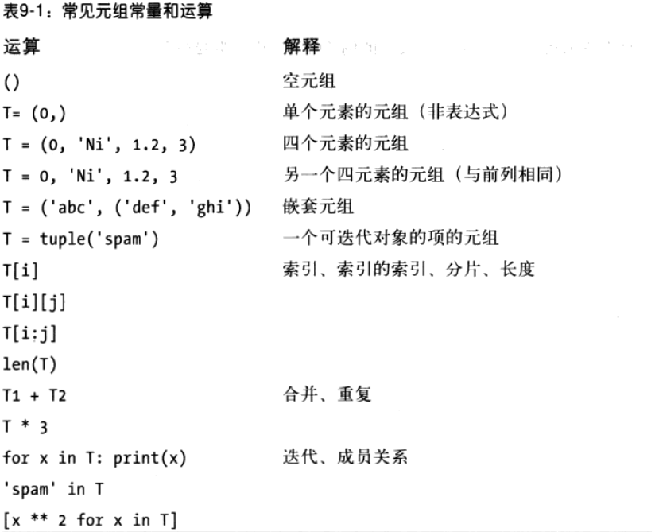
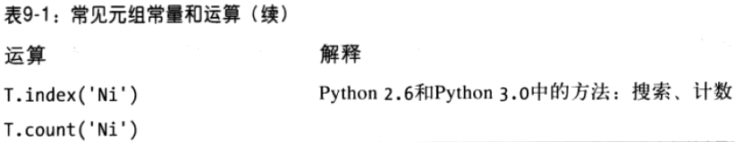
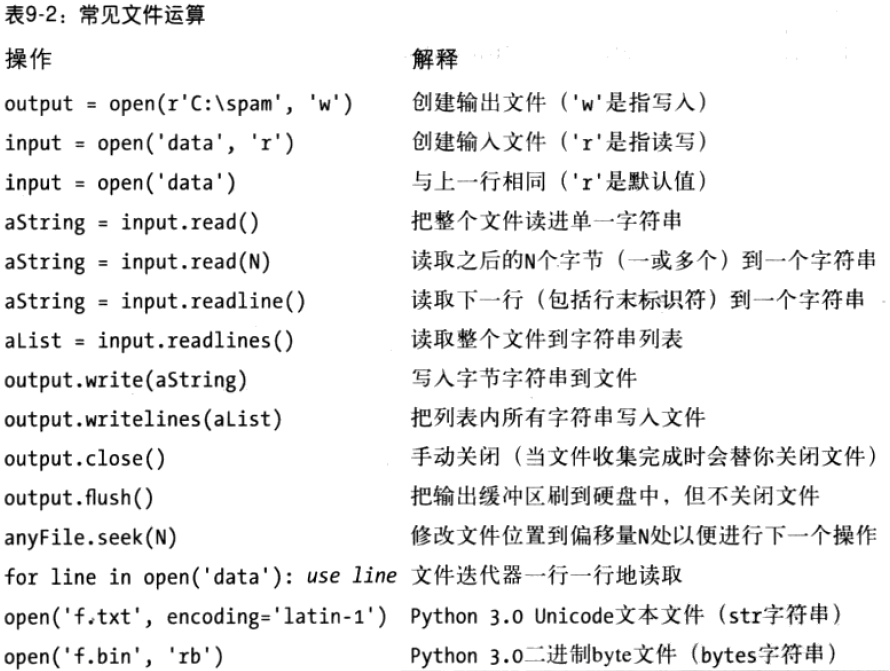
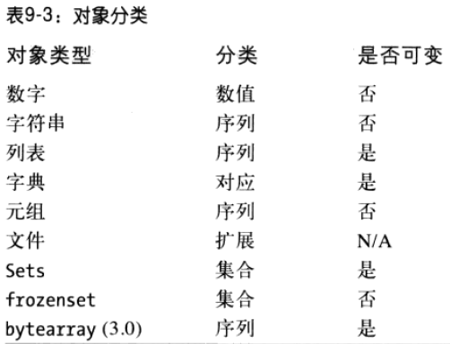
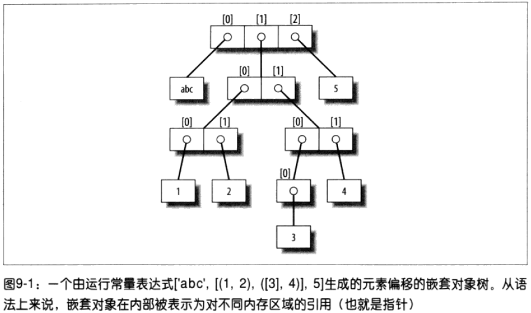
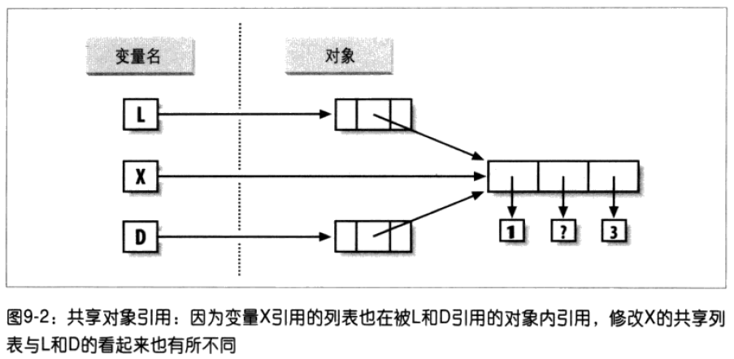
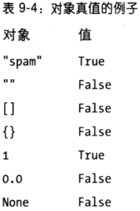
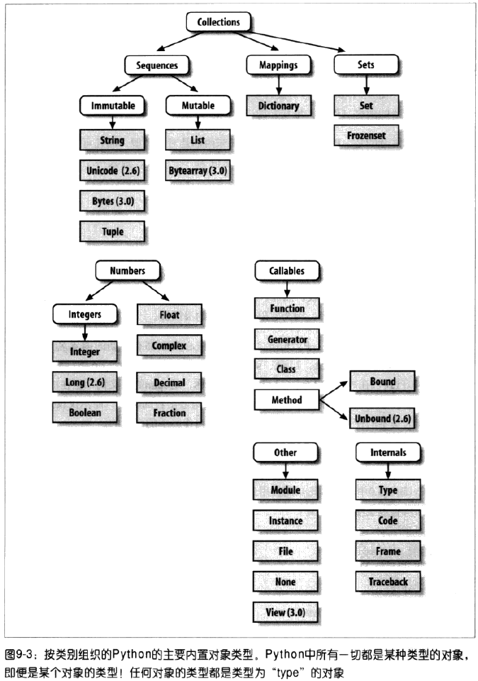

# 元组文件及其它 #

[1.元组](#元组)

[1.1.实际应用中的元组](#实际应用中的元组)

[1.1.1.元组的特殊语法：逗号和圆括号](#元组的特殊语法逗号和圆括号)

[1.2.为什么有了列表还要元组](#为什么有了列表还要元组)

[2.文件](#文件)

[2.1.打开文件](#打开文件)

[2.2.使用文件](#使用文件)

[2.3.实际应用中文件](#实际应用中文件)

[2.3.1.Python3中的文本和二进制文件](#python3中的文本和二进制文件)

[2.3.2.在文件中存储并解析Python对象](#在文件中存储并解析python对象)

[2.3.3.用pickle存储Python的原生对象](#用pickle存储python的原生对象)

[2.3.4.文件中打包二进制数据的存储于解析](#文件中打包二进制数据的存储于解析)

[2.3.5.文件上下文管理器](#文件上下文管理器)

[2.4.其他文件工具](#其他文件工具)

[3.重访类型分类](#重访类型分类)

[3.1.为什么要在意操作符重载](#为什么要在意操作符重载)

[4.对象灵活性](#对象灵活性)

[5.引用VS拷贝](#引用vs拷贝)

[6.比较、相等性和真值](#比较相等性和真值)

[6.1.Python3的字典比较](#python3的字典比较)

[6.2.Python中真和假的含义](#python中真和假的含义)

[6.2.1.None对象](#none对象)

[6.2.2.bool类型](#bool类型)

[6.3.Python的类型层次](#python的类型层次)

[6.4.Type对象](#type对象)

[7.Python中的其他类型](#python中的其他类型)

[7.1.内置类型陷阱](#内置类型陷阱)

[7.2.赋值生成引用而不是拷贝](#赋值生成引用而不是拷贝)

[7.3.重复能够增加层次深度](#重复能够增加层次深度)

[7.4.留意循环数据结构](#留意循环数据结构)

[7.5.不可变类型不可以在原处改变](#不可变类型不可以在原处改变)

[8.本章小结](#本章小结)

## 元组 ##

- 任意对象的有序集合
- 通过偏移存取
- 属于不可变序列类型
- 固定长度、异构、任意嵌套
- 对象引用的数组

### 实际应用中的元组 ###

	>>> (1, 2) + (3, 4)          # Concatenation
	(1, 2, 3, 4)

	>>> (1, 2) * 4               # Repetition
	(1, 2, 1, 2, 1, 2, 1, 2)

	>>> T = (1, 2, 3, 4)         # Indexing, slicing
	>>> T[0], T[1:3]
	(1, (2, 3))

#### 元组的特殊语法：逗号和圆括号 ####

	>>> x = (40)        # An integer!
	>>> x
	40
	>>> y = (40,)       # A tuple containing an integer
	>>> y
	(40,)

### 为什么有了列表还要元组 ###

元组的不可变性提供了某种完整性，这样可确保元组在程序中不会被另一个引用修改，而列表就没有这样的保证了。

元组的应用：字典键

凭经验来说，列表时定序集合的选择工具，可能需要进行修改，而元组能够处理其他固定关系的情况。

## 文件 ##

### 打开文件 ###

open函数第一参数：文件路径，缺省假定存在当前的工作目录当中。

open函数第二参数：处理模式

- r 输入打开文件（默认值）
- w 输出生成并打开文件
- a 在文件尾部追加内容并打开文件

处理模式参数指定为其他选项

- 在模式字符串尾部加上b可进行二进制数据处理（行末转换和Python3 Unicode编码被关闭了）。
- 加上“+”意味着同时为输入和输出打开文件（可对相同文件对象进行读写，往往与对文件中的修改的查找操作配合使用）。

open函数第三参数：可选，它能够用来控制输出缓存：传入“0”意味着输出无缓存（写入方法调用时立即传给外部文件）。

### 使用文件 ###

- 文件迭代器是最好的读取行工具
- 内容是字符串，不是对象
- close是通常的选项（手动close是良好的习惯）
- 文件是缓冲的并且是可查找的

### 实际应用中文件 ###

	>>> myfile = open('myfile.txt', 'w')          # Open for text output: create/empty
	>>> myfile.write('hello text file\n')         # Write a line of text: string
	16
	>>> myfile.write('goodbye text file\n')
	18
	>>> myfile.close()                            # Flush output buffers to disk

	>>> myfile = open('myfile.txt')               # Open for text input: 'r' is default
	>>> myfile.readline()                         # Read the lines back
	'hello text file\n'
	>>> myfile.readline()
	'goodbye text file\n'
	>>> myfile.readline()                         # Empty string: end of file
	''

	>>> open('myfile.txt').read()                 # Read all at once into string
	'hello text file\ngoodbye text file\n'

	>>> print(open('myfile.txt').read())          # User-friendly display
	hello text file
	goodbye text file

	>>> for line in open('myfile'):               # Use file iterators, not reads
	...     print(line, end='')
	...
	hello text file
	goodbye text file

#### Python3中的文本和二进制文件 ####

	# NOTE: there was an unfortunate error in the following in 
	# the first printing (a "data = data[4:8]" line was lost in 
	# a bad cut-and-paste); I've corrected the code here

	>>> data = open('data.bin', 'rb').read()      # Open binary file: rb=read binary
	>>> data                                      # bytes string holds binary data
	b'\x00\x00\x00\x07spam\x00\x08'
	>>> data[4:8]                                 # Act like strings
	b'spam'
	>>> data[4:8][0]                              # But really are small 8-bit integers
	115
	>>> bin(data[4:8][0])                         # Python 3.0 bin() function
	'0b1110011'

#### 在文件中存储并解析Python对象 ####

写入数据

	>>> X, Y, Z = 43, 44, 45                    # Native Python objects
	>>> S = 'Spam'                              # Must be strings to store in file
	>>> D = {'a': 1, 'b': 2}
	>>> L = [1, 2, 3]
	>>>
	>>> F = open('datafile.txt', 'w')           # Create output file
	>>> F.write(S + '\n')                       # Terminate lines with \n
	>>> F.write('%s,%s,%s\n' % (X, Y, Z))       # Convert numbers to strings
	>>> F.write(str(L) + '$' + str(D) + '\n')   # Convert and separate with $
	>>> F.close()

---

读取数据

	>>> chars = open('datafile.txt').read()           # Raw string display
	>>> chars
	"Spam\n43,44,45\n[1, 2, 3]${'a': 1, 'b': 2}\n"
	>>> print(chars)                                  # User-friendly display
	Spam
	43,44,45
	[1, 2, 3]${'a': 1, 'b': 2}

---

解析数据

	>>> F = open('datafile.txt')           # Open again
	>>> line = F.readline()                # Read one line
	>>> line
	'Spam\n'
	>>> line.rstrip()                      # Remove end-of-line
	'Spam'

	>>> line = F.readline()                # Next line from file
	>>> line                               # It's a string here
	'43,44,45\n'
	>>> parts = line.split(',')            # Split (parse) on commas
	>>> parts
	['43', '44', '45\n']

	>>> int(parts[1])                      # Convert from string to int
	44
	>>> numbers = [int(P) for P in parts]  # Convert all in list at once
	>>> numbers
	[43, 44, 45]

---

eval函数能将字符串当作可执行代码

	>>> line = F.readline()
	>>> line
	"[1, 2, 3]${'a': 1, 'b': 2}\n"
	>>> parts = line.split('$')            # Split (parse) on $
	>>> parts
	['[1, 2, 3]', "{'a': 1, 'b': 2}\n"]
	>>> eval(parts[0])                     # Convert to any object type
	[1, 2, 3]
	>>> objects = [eval(P) for P in parts] # Do same for all in list
	>>> objects
	[[1, 2, 3], {'a': 1, 'b': 2}]

#### 用pickle存储Python的原生对象 ####

eval函数，有点强大

	>>> D = {'a': 1, 'b': 2}
	>>> F = open('datafile.pkl', 'wb')
	>>> import pickle
	>>> pickle.dump(D, F)                  # Pickle any object to file
	>>> F.close()

	>>> F = open('datafile.pkl', 'rb')
	>>> E = pickle.load(F)                 # Load any object from file
	>>> E
	{'a': 1, 'b': 2}

	>>> open('datafile.pkl', 'rb').read()  # Format is prone to change!
	b'\x80\x03}q\x00(X\x01\x00\x00\x00aq\x01K\x01X\x01\x00\x00\x00bq\x02K\x02u.'

#### 文件中打包二进制数据的存储于解析 ####

[struct doc](https://docs.python.org/3/library/struct.html)

存储

	>>> F = open('data.bin', 'wb')                   # Open binary output file
	>>> import struct
	>>> data = struct.pack('>i4sh', 7, 'spam', 8)    # Make packed binary data
	>>> data
	b'\x00\x00\x00\x07spam\x00\x08'
	>>> F.write(data)                                # Write byte string
	>>> F.close()

读取

	>>> F = open('data.bin', 'rb')
	>>> data = F.read()                              # Get packed binary data
	>>> data
	b'\x00\x00\x00\x07spam\x00\x08'
	>>> values = struct.unpack('>i4sh', data)        # Convert to Python objects
	>>> values
	(7, 'spam', 8)

#### 文件上下文管理器 ####

比文件自身多了一个异常处理功能，它允许把文件处理代码包装到一个逻辑层中，以确保在退出后可以自动关闭文件。

	with open(r'C:\misc\data.txt') as myfile:        # See Chapter 33 for details
		for line in myfile:
			...use line here...

try/finally可提供类似功能

	myfile = open(r'C:\misc\data.txt')
	try:
		for line in myfile:
			...use line here...
	finally:
		myfile.close()

### 其他文件工具 ###

- 标准流
- os模块终的描述文件
- sockets、pipes和FIFO文件
- 通过键来存取的文件
- Shell命令流

## 重访类型分类 ##

- 对象根据分类来共享操作；例如，字符串、列表和元组都共享诸如合并、长度和索引等序列操作。

- 只有可变对象(列表、字典和集合)可以原处修改；我们不能原处修改数字、字符串或元组。

- 文件导出唯一的方法，因此可变性并不真的适用于它们一当处理文件的时候，它们的状态可能会修改，但是，这与 Python的核心类型可变性限制不完全相同。

- 下表中的“数字”包含了所有数字类型:整数(与 Python2.6的整数有区别)、浮点数、复数、小数和分数

- 下表中的字符串包括str，以及 Python3.0中的 bytes和 Python2.6中的 unicode Python3.0中的 bytearray字符串类型是可变的。

- 集合类似于一个无值的字典的键，但是，它们不能映射为值，并且没有顺序:因此，集合不是一个映射类型或者一个序列类型， frozenset/是集合的一个不可变的版本。

- 除了类型分类操作，下表中的 Python2.6和 Python3.0的所有类型都有可调用的方法，这些方法通常特定于它们的类型。

### 为什么要在意操作符重载 ###

	class MySequence:
		# 索引
		def __getitem__(self, index):
			# Called on self[index], others

		# 合并
		def __add__(self, other):
			# Called on self + other

## 对象灵活性 ##

Python复合对象类型支持任意，因此对于表达程序中复杂的信息它们是相当拿手的。

	>>> L = ['abc', [(1, 2), ([3], 4)], 5]
	>>> L[1]
	[(1, 2), ([3], 4)]
	>>> L[1][1]
	([3], 4)
	>>> L[1][1][0]
	[3]
	>>> L[1][1][0][0]
	3

## 引用VS拷贝 ##

**赋值操作总是储存对象的引用，而不是这些对象的拷贝。**

赋值操作会产生相同对象的多个引用，需要意识到在原处修改可变对象时可能会影响程序中其他地方对相同对象的其他引用。若不这样做，需明确告诉Python复制该对象。

	>>> X = [1, 2, 3]
	>>> L = ['a', X, 'b']          # Embed references to X's object
	>>> D = {'x':X, 'y':2}

修改这三个引用中任意一个共享列表对象，也会改变另外两个引用的对象。

	>>> X[1] = 'surprise'          # Changes all three references!
	>>> L
	['a', [1, 'surprise', 3], 'b']
	>>> D
	{'x': [1, 'surprise', 3], 'y': 2}

引用的好处，可在程序范围内任何地方传递大型对象而不必在途中产生拷贝。

需要拷贝的话，进行的操作：

- 没有限制条件的分片表达式（L[:]）能够复制序列。

- 字典copy方法（X.copy()）能够复制字典。

- 有些内置函数（例如,list）能够生成拷贝（list(L)）。

- copy标准库模块能够生成完整拷贝。

	>>> L = [1,2,3]
	>>> D = {'a':1, 'b':2}

	>>> A = L[:]            # Instead of A = L (or list(L))
	>>> B = D.copy()        # Instead of B = D (ditto for sets)

	>>> A[1] = 'Ni'
	>>> B['c'] = 'spam'
	>>>
	>>> L, D
	([1, 2, 3], {'a': 1, 'b': 2})
	>>> A, B
	([1, 'Ni', 3], {'a': 1, 'c': 'spam', 'b': 2})

	>>> X = [1, 2, 3]
	>>> L = ['a', X[:], 'b']     # Embed copies of X's object
	>>> D = {'x':X[:], 'y':2}

## 比较、相等性和真值 ##

	>>> L1 = [1, ('a', 3)]         # Same value, unique objects
	>>> L2 = [1, ('a', 3)]
	>>> L1 == L2, L1 is L2         # Equivalent? Same object?
	(True, False)

- “==”操作符测试值的相等性。Python运行相等测试，递归比较所有内嵌对象。（与Java的不同）
- “is”表达式测试对象的一致性。Python测试两者是否是同一个对象。

	>>> L1 = [1, ('a', 3)]         # Same value, unique objects
	>>> L2 = [1, ('a', 3)]
	>>> L1 == L2, L1 is L2         # Equivalent? Same object?
	(True, False)

	>>> S1 = 'spam'
	>>> S2 = 'spam'

	# Python短字符串重复引用同一对象
	>>> S1 == S2, S1 is S2
	(True, True)

	>>> S1 = 'a longer string'
	>>> S2 = 'a longer string'
	# # Python长字符串不引用同一对象
	>>> S1 == S2, S1 is S2
	(True, False)

比较大小

	>>> L1 = [1, ('a', 3)]
	>>> L2 = [1, ('a', 2)]
	>>> L1 < L2, L1 == L2, L1 > L2     # Less, equal, greater: tuple of results
	(False, False, True)

Python比较方法：

- 数字通过相对大小进行比较；
- 字符串是按照字典顺序，一个字符接一个字符地对比进行比较（"abc"<"ac"）；
- 列表和元组从左到右对每部分的内容进行比较。
- 字典通过排序之后的(键、值)列表进行比较。字典的相对大小比较在 Python3.0中不支持，但是，它们在 Python2.6及更早的版本中有效，就像是比较排序的(键、值)列表一样。
- 数字混合类型比较(例如，1<'spam')在 Python3.0中是错误的。 Python2.6中允许这样的比较，但是使用一种固定但任意的排序规则。通过代理，这也适用于排序，它在内部使用比较：非数字的混合类型集合不能在 Python3.0中排序。

### Python3的字典比较 ###

	C:\misc> c:\python26\python
	>>> D1 = {'a':1, 'b':2}
	>>> D2 = {'a':1, 'b':3}
	>>> D1 == D2
	False
	>>> D1 < D2
	True

Python3的字典比较方法

	C:\misc> c:\python30\python
	>>> D1 = {'a':1, 'b':2}
	>>> D2 = {'a':1, 'b':3}
	>>> D1 == D2
	False
	>>> D1 < D2
	TypeError: unorderable types: dict() < dict()

	>>> list(D1.items())
	[('a', 1), ('b', 2)]
	>>> sorted(D1.items())
	[('a', 1), ('b', 2)]

	>>> sorted(D1.items()) < sorted(D2.items())
	True
	>>> sorted(D1.items()) > sorted(D2.items())
	False

### Python中真和假的含义 ###

每个对象不是真就是假

- 数字如果非零，则为真
- 其他对象如果非空，则为真

#### None对象 ####

None不是意味着“未定义”。也就是说，None是某些内容，而不是没有内容（尽管起的名字是没有内容）——它是一个真正的对象，并且有一块内存，由Python给定一个内置名称。

它还是函数的默认返回值。

	>>> L=[None]*100
	>>> L
	[None, None, None, None, None, None, None, None, None, None, None, None, None, N
	one, None, None, None, None, None, None, None, None, None, None, None, None, Non
	e, None, None, None, None, None, None, None, None, None, None, None, None, None,
	 None, None, None, None, None, None, None, None, None, None, None, None, None, N
	one, None, None, None, None, None, None, None, None, None, None, None, None, Non
	e, None, None, None, None, None, None, None, None, None, None, None, None, None,
	 None, None, None, None, None, None, None, None, None, None, None, None, None, N
	one, None, None, None, None, None, None]
	>>> L is False
	False
	>>> L is True
	False
	>>> bool(L)
	True
	>>>

#### bool类型 ####

Python的布尔类型bool只不过是扩展了Python中真、假的概念。

- 当明确用在真值测试时，True和False会变成1和0，但它们使得程序员的意图更加明确。
- 交互模式下运行的布尔测试的结果打印成True和False字样，而不是1和0，以使得程序的结果更明确。

**像if这样的逻辑语句中，没必要只用布尔类型**。所有对象本质上依然是非真既假，即使使用其他类型。 

可以使用内置函数bool，用来测试一个对象的布尔值。

	>>> bool(1)
	True
	>>> bool('spam')
	True
	>>> bool({})
	False

### Python的类型层次 ###

Python系统中的任何东西都是对象类型，而且可以由Python程序来处理。

### Type对象 ###

即使类型本身在Python也是对象类型。

可用type函数返回对象X的类型对象。但这函数限制代码的灵活性。

	# 下面皆返回True值
	type([1]) == type([])             # Type of another list
	type([1]) == list                 # List type name
	isinstance([1], list)             # List or customization thereof

	import types                      # types has names for other types
	def f(): pass
	type(f) == types.FunctionType

Python的类型也可以分为子类，一般都建议使用isinstance函数。

## Python中的其他类型 ##

如：正则表达式对象、DBM文件、GUI组件、网络套接字

这些类型与内置类型的区别：内置类型有针对它们对象的特殊语言生成语法（如[]生成列表），而其他类型必须先导入才可使用

### 内置类型陷阱 ###

略

### 赋值生成引用而不是拷贝 ###

	>>> L = [1, 2, 3]
	>>> M = ['X', L, 'Y']      # Embed a reference to L
	>>> M
	['X', [1, 2, 3], 'Y']

	>>> L[1] = 0               # Changes M too
	>>> M
	['X', [1, 0, 3], 'Y']

	>>> L = [1, 2, 3]
	>>> M = ['X', L[:], 'Y']   # Embed a copy of L
	>>> L[1] = 0               # Changes only L, not M
	>>> L
	[1, 0, 3]
	>>> M
	['X', [1, 2, 3], 'Y']

### 重复能够增加层次深度 ###

	>>> L = [4, 5, 6]
	>>> X = L * 4              # Like [4, 5, 6] + [4, 5, 6] + ...
	>>> Y = [L] * 4            # [L] + [L] + ... = [L, L,...]
	>>> X
	[4, 5, 6, 4, 5, 6, 4, 5, 6, 4, 5, 6]
	>>> Y
	[[4, 5, 6], [4, 5, 6], [4, 5, 6], [4, 5, 6]]

	>>> L[1] = 0               # Impacts Y but not X
	>>> X
	[4, 5, 6, 4, 5, 6, 4, 5, 6, 4, 5, 6]
	>>> Y
	[[4, 0, 6], [4, 0, 6], [4, 0, 6], [4, 0, 6]]

重复、合并以及分片只是在复制操作数对象的顶层。（浅复制）

### 留意循环数据结构 ###

	>>> L = ['grail']         # Append reference to same object
	>>> L.append(L)           # Generates cycle in object: [...]
	>>> L
	['grail', [...]] # 循环引用，最好不要这样

### 不可变类型不可以在原处改变 ###

	T = (1, 2, 3)
	T[2] = 4                 # Error!
	T = T[:2] + (4,)         # OK: (1, 2, 4)

## 本章小结 ##

