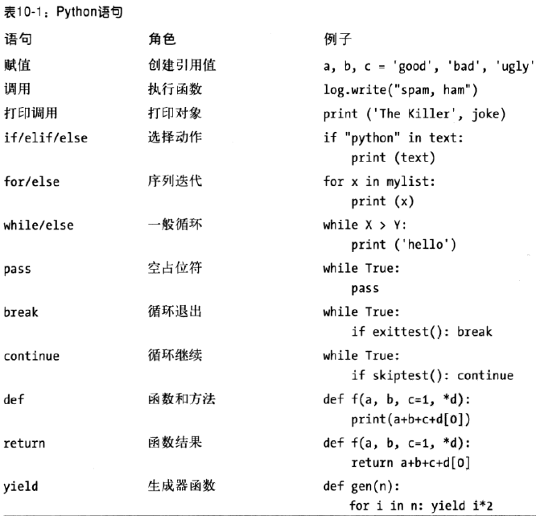

# Python语句简介 #

Python是面向过程的、基于语句的语言。

## 重访Python程序结构 ##

1. 程序由模块构成；
2. 模块包含语句；
3. 语句包含表达式；
4. 表达式建立并处理对象

### Python语句 ###

## 两个if的故事 ##

### Python增加了什么 ###

答：冒号（:）

Python的复合语句（也就是语句中嵌套了语句）都有相同的一般形式，也就是首行下一行嵌套的代码往往按缩进的格式书写。

冒号不可或缺。

### Python删除了什么 ###

#### 括号有时可选 ####

	if (x < y)
	
	if x < y

#### 终止行就是终止语句 ####

	x = 1

#### 缩进的结束就是代码块的结束 ####

略

### 为什么使用缩进语法 ###

若嵌套代码块缩进的不一致，它们很难解释、修改或者再使用。

### 几个特殊实例 ###

	# 1. 多句混在一句
	a=1; b=2; print(a+b)

	# 2. () [] {} \可让一语句跨多行
	list=[1,
		2,
		3]

	X = (A + B +
		C + D)

	if (A == 1 and
		B == 2 and
		C == 3):
		print "a"

	X = A + B + \
		C + D

	# 3. 主体放在冒号后
	if x > y: print(x)

## 简短实例：交互循环 ##

### 一个简单的交互式循环 ###

	while True:
		reply = input('Enter text:')
		if reply == 'stop': break
		print(reply.upper())

### 对用户输入数据做数据运算 ###

	>>> reply = '20'
	>>> reply ** 2
	...error text omitted...

	>>> int(reply) ** 2
	400

---

	while True:
		reply = input('Enter text:')
		if reply == 'stop': break
		print(int(reply) ** 2)
	print('Bye')

### 用测试输入数据来处理错误 ###

	>>> S = '123'
	>>> T = 'xxx'
	>>> S.isdigit(), T.isdigit()
	(True, False)

---

	while True:
		reply = input('Enter text:')
		if reply == 'stop':
			break
		elif not reply.isdigit():
			print('Bad!' * 8)
		else:
			print(int(reply) ** 2)
	print('Bye')

### 用try语句处理错误 ###

	while True:
		reply = input('Enter text:')
		if reply == 'stop': break
		try:
			num = int(reply)
		except:
			print('Bad!' * 8)
		else:
			print(int(reply) ** 2)
	print('Bye')

### 嵌套代码三层 ###

	while True:
		reply = input('Enter text:')
		if reply == 'stop':
			break
		elif not reply.isdigit():
			print('Bad!' * 8)
		else:
			num = int(reply)
			if num < 20:
				print('low')
			else:
				print(num ** 2)
	print('Bye')

## 本章小结 ##

