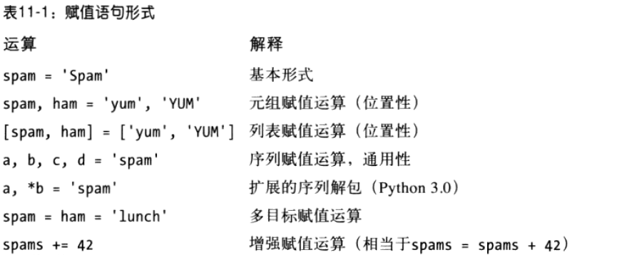

# 赋值、表达式和打印 #

## 赋值语句 ##

赋值特性：

- 赋值语句建立对象引用值
- 变量名在首次赋值时会被创建
- 变量名在使用前必须先赋值
- 执行隐式赋值的一些操作（如模块导入、函数等）

### 赋值语句的形式 ###

### 序列赋值 ###

	>>> nudge = 1
	>>> wink  = 2
	# 元组赋值运算
	>>> A, B = nudge, wink             # Tuple assignment
	>>> A, B                           # Like A = nudge; B = wink
	(1, 2)

	# 列表赋值运算
	>>> [C, D] = [nudge, wink]         # List assignment
	>>> C, D
	(1, 2)

---

	# 交换两值，未用中间量
	>>> nudge = 1
	>>> wink  = 2
	>>> nudge, wink = wink, nudge      # Tuples: swaps values
	>>> nudge, wink                    # Like T = nudge; nudge = wink; wink = T
	(2, 1)

---

	>>> [a, b, c] = (1, 2, 3)          # Assign tuple of values to list of names
	>>> a, c
	(1, 3)
	>>> (a, b, c) = "ABC"              # Assign string of characters to tuple
	>>> a, c
	('A', 'C')

---

	# 高级序列赋值语句模式
	>>> string = 'SPAM'
	>>> a, b, c, d = string                            # Same number on both sides
	>>> a, d
	('S', 'M')

	>>> a, b, c = string                               # Error if not
	...error text omitted...
	ValueError: too many values to unpack

	>>> a, b, c = string[0], string[1], string[2:]     # Index and slice
	>>> a, b, c
	('S', 'P', 'AM')

	>>> a, b, c = list(string[:2]) + [string[2:]]      # Slice and concatenate
	>>> a, b, c
	('S', 'P', 'AM')

	>>> a, b = string[:2]                              # Same, but simpler
	>>> c = string[2:]
	>>> a, b, c
	('S', 'P', 'AM')

	>>> (a, b), c = string[:2], string[2:]             # Nested sequences
	>>> a, b, c
	('S', 'P', 'AM')

	>>> ((a, b), c) = ('SP', 'AM')                     # Paired by shape and position
	>>> a, b, c
	('S', 'P', 'AM')

	for (a, b, c) in [(1, 2, 3), (4, 5, 6)]: ...…          # Simple tuple assignment

	for ((a, b), c) in [((1, 2), 3), ((4, 5), 6)]: ...…    # Nested tuple assignment

	def f(((a, b), c)):              # For arguments too in Python 2.6, but not 3.0
	f(((1, 2), 3))

	>>> red, green, blue = range(3)
	>>> red, blue
	(0, 2)

	>>> range(3)                             # Use list(range(3)) in Python 3.0
	[0, 1, 2]

	>>> L = [1, 2, 3, 4]
	>>> while L:
	...     front, L = L[0], L[1:]           # See next section for 3.0 alternative
	...     print(front, L)
	...
	1 [2, 3, 4]
	2 [3, 4]
	3 [4]
	4 []

### Python3中扩展序列解包 ###

一个带有单个星号的名称，可以在赋值目标中使用，以指定对于序列的一个更为通用的匹配——一个列表赋给了带星号的名称，该列表收集了序列中没有赋值给其他名称的所有项。

	C:\misc> c:\python30\python
	>>> seq = [1, 2, 3, 4]
	>>> a, b, c, d = seq
	>>> print(a, b, c, d)
	1 2 3 4

	>>> a, b = seq
	ValueError: too many values to unpack

---

	>>> a, *b = seq
	>>> a
	1
	>>> b
	[2, 3, 4]

---

	>>> *a, b = seq
	>>> a
	[1, 2, 3]
	>>> b
	4

---

	>>> a, *b, c = seq
	>>> a
	1
	>>> b
	[2, 3]
	>>> c
	4

---

	>>> a, b, *c = seq
	>>> a
	1
	>>> b
	2
	>>> c
	[3, 4]

---

	>>> a, *b = 'spam'
	>>> a, b
	('s', ['p', 'a', 'm'])

	>>> a, *b, c = 'spam'
	>>> a, b, c
	('s', ['p', 'a'], 'm')

---

	>>> S = 'spam'

	>>> S[0], S[1:]       # Slices are type-specific, * assignment always returns a list
	('s', 'pam')

	>>> S[0], S[1:3], S[3]     
	('s', 'pa', 'm')

---

	>>> L = [1, 2, 3, 4]
	>>> while L:
	...     front, *L = L                    # Get first, rest without slicing
	...     print(front, L)
	...
	1 [2, 3, 4]
	2 [3, 4]
	3 [4]
	4 []

---

	>>> seq
	[1, 2, 3, 4]

	>>> a, b, c, *d = seq
	>>> print(a, b, c, d)
	1 2 3 [4]

---

	# 没剩余的赋值
	>>> a, b, c, d, *e = seq
	>>> print(a, b, c, d, e)
	1 2 3 4 []

	>>> a, b, *e, c, d = seq
	>>> print(a, b, c, d, e)
	1 2 3 4 []

---

错误使用*的情况

	>>> a, *b, c, *d = seq
	SyntaxError: two starred expressions in assignment

	>>> a, b = seq
	ValueError: too many values to unpack

	>>> *a = seq
	SyntaxError: starred assignment target must be in a list or tuple

	>>> *a, = seq
	>>> a
	[1, 2, 3, 4]

---

	>>> seq
	[1, 2, 3, 4]

	>>> a, *b = seq                        # First, rest
	>>> a, b
	(1, [2, 3, 4])

	>>> a, b = seq[0], seq[1:]             # First, rest: traditional
	>>> a, b
	(1, [2, 3, 4])

---

	>>> *a, b = seq                        # Rest, last
	>>> a, b
	([1, 2, 3], 4)

	>>> a, b = seq[:-1], seq[-1]           # Rest, last: traditional
	>>> a, b
	([1, 2, 3], 4)

---

	for (a, *b, c) in [(1, 2, 3, 4), (5, 6, 7, 8)]: 
		...

	a, *b, c = (1, 2, 3, 4)                            # b gets [2, 3]

	for (a, b, c) in [(1, 2, 3), (4, 5, 6)]:           # a, b, c = (1, 2, 3), ...

	for all in [(1, 2, 3, 4), (5, 6, 7, 8)]:
		a, b, c = all[0], all[1:3], all[3]

### 多目标赋值语句 ###

	>>> a = b = c = 'spam'
	>>> a, b, c
	('spam', 'spam', 'spam')

---

	>>> c = 'spam'
	>>> b = c
	>>> a = b

---

	>>> a = b = 0
	>>> b = b + 1
	>>> a, b
	(0, 1)

---

	>>> a = b = []
	>>> b.append(42)
	>>> a, b
	([42], [42])

---

	>>> a = []
	>>> b = []
	>>> b.append(42)
	>>> a, b
	([], [42])

### 增强赋值语句 ###

### 变量命名规则 ###

### Python的废弃协议 ###

## 表达式语句 ##

### 表达式语句和在原处的修改 ###

## 打印操作 ##

### Python3的print函数 ###

### Python2.6 print语句 ###

### 打印流重定向 ###

### 版本独立的打印 ###

### 为什么要注意print和stdout ###

## 本章小结 ##

